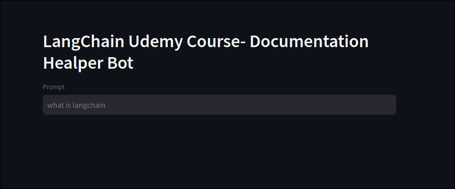

# Introducing the Steamlit

We'll use the `streamlit` library to create a simple web app that displays the result of our beckend rag chain response.

```sh
 tree
.
├── backend
│   ├── core.py
│   └── __init__.py
├── ingestion.py
├── langchain-docs
├── LICENSE
├── main.py # create this file to write frontend code with streamlit
├── Pipfile
├── Pipfile.lock
└── README.md
```

We need to install the `streamlit` library first.

```sh
pipenv install streamlit
```

Then, we can use it in our codes and also has CLI to run the app.

```py
from typing import Set
from backend.core import run_llm
import streamlit as st


st.header("LangChain Udemy Course- Documentation Healper Bot") # Title

prompt = st.text_input("Prompt", placeholder="Enter your prompt here...") # Input field, user input will be stored in the variable `prompt`

# a function to convert the set of source urls to a single formatted string
def create_sources_string(source_urls: Set[str]) -> str:
    if not source_urls:
        return ""
    sources_list = list(source_urls)
    sources_list.sort()
    sources_string = "Sources: \n"
    for i, source in enumerate(sources_list):
        sources_string += f"{i+1}. {source} \n"
    return sources_string

if prompt:
    with st.spinner("Generating text..."): # Spinner to show the user that the text is being generated
        response = run_llm(query=prompt) # Call the backend function `run_llm` with the user input to generate the response
        sources = set([doc.metadata["source"] for doc in response["source_documents"]]) # Extract the source urls from the response and use set to remove duplicates
        formatted_response = f"{response['result']}\n {create_sources_string(sources)}" # Format the response to display the result and the source urls
        print(formatted_response)

```

To run the app, we can use the CLI provided by `streamlit`.

```sh
streamlit run main.py
```

It'll open a new tab in your default browser with the app running.




Let's input a prompt `What is the langchain?` and see the `formatted_response` in the console.

```sh
LangChain is a framework designed to facilitate the development of applications tha
t utilize language models (LLMs). It provides various integrations and tools to wor
k with different data sources, caching mechanisms, chat history management, embeddi
ngs, and retrieval strategies. LangChain supports various backends, such as MongoDB
, Airbyte, Elasticsearch, and Weaviate, allowing developers to build applications t
hat can efficiently handle and process natural language data.
 Sources: 
1. https://api.python.langchain.com/en/latest/airbyte_api_reference.html 
2. https://api.python.langchain.com/en/latest/elasticsearch_api_reference.html 
3. https://api.python.langchain.com/en/latest/mongodb_api_reference.html 
4. https://api.python.langchain.com/en/latest/weaviate_api_reference.html 
```


