# Adding Sidebar and LangChains color theme with Cursor Compose

For this topic, we will optimize the Streamlit UI using a cursor and add a sidebar and Langchain's color theme.

The cursor has pre-indexed many library documents, and we can use @ to directly add them to the context.

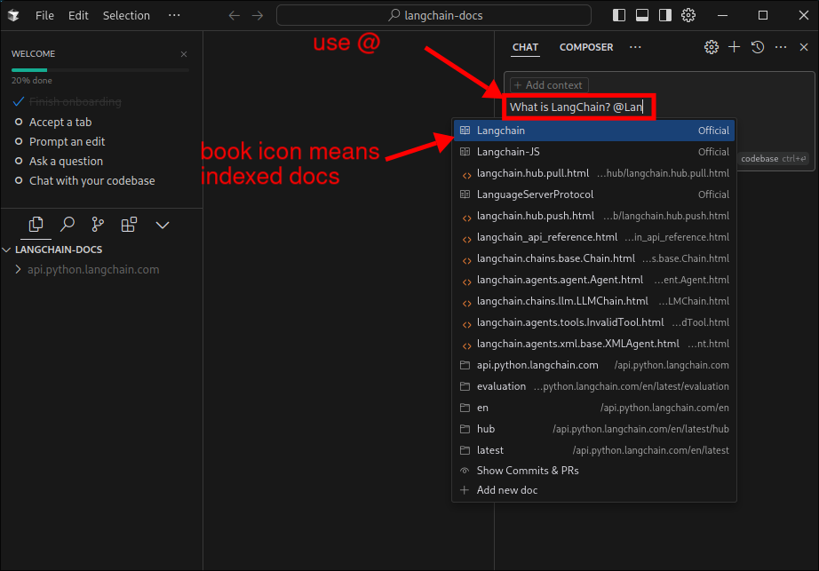

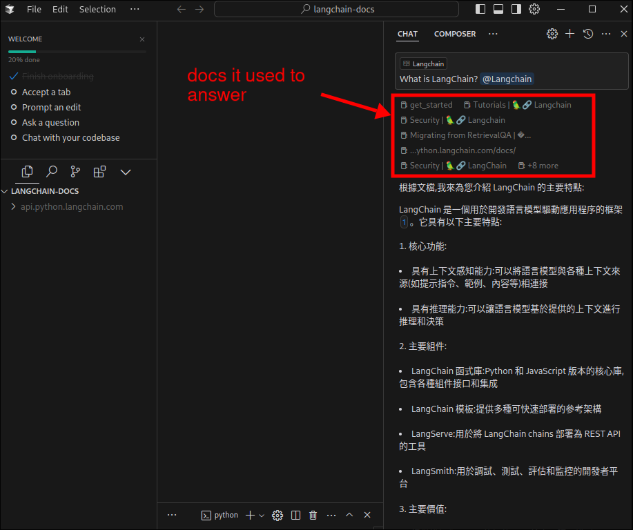

The function demonstrated above is very similar to the app we are developing in this section, which is simply focused on question and answer for a document content. However, the cursor will be optimized further, so the effect should be better.

## Using Cursor Composer to add a sidebar

We open our project file, use cursor composer to enter instructions to generate code to meet the requirements.

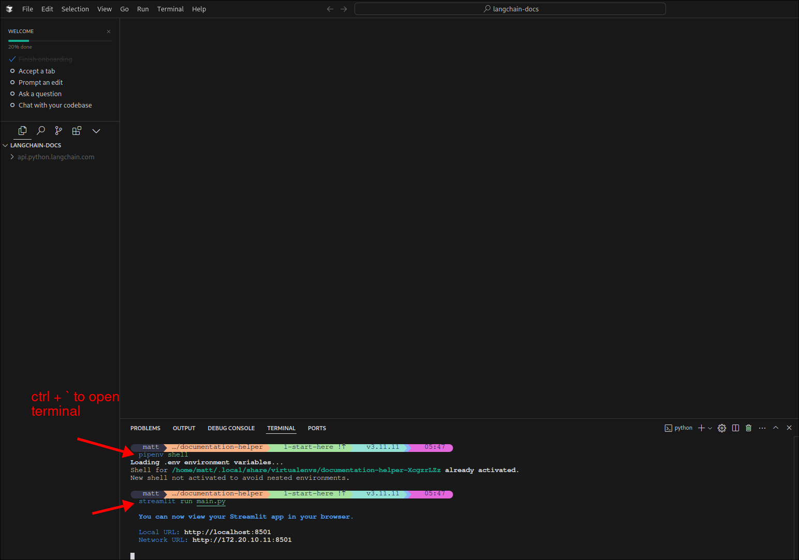

Don't forget to enter pipenv shell and launch the Streamlit app.

In the Cursor Composer, we can still add any library documents to the context by using @ as well, sometimes it's important to let the cursor know what we are doing. (in our case, if we don't @streamlit, the cursor will not know we are using Streamlit, so it'll generate code for other libraries or even languages)

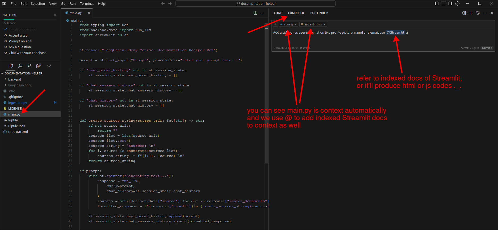

Then we can accept each block one by one or just click `Accept All` to accept all blocks at once.

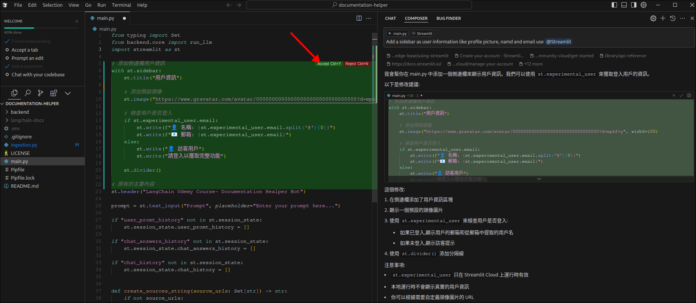

Check the result on the browser, we see the error message as below:

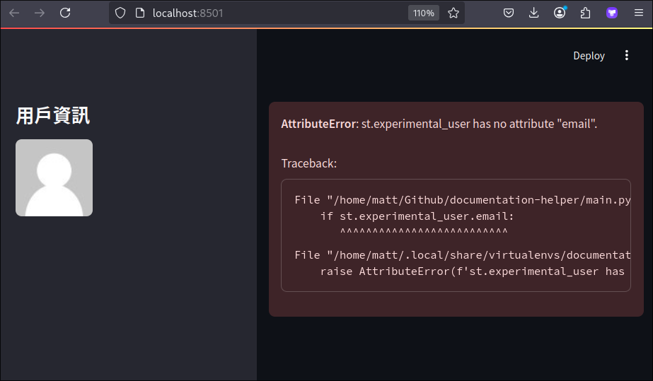

Just copy the error message and paste it to the Cursor Composer again to let the cursor know what happened.

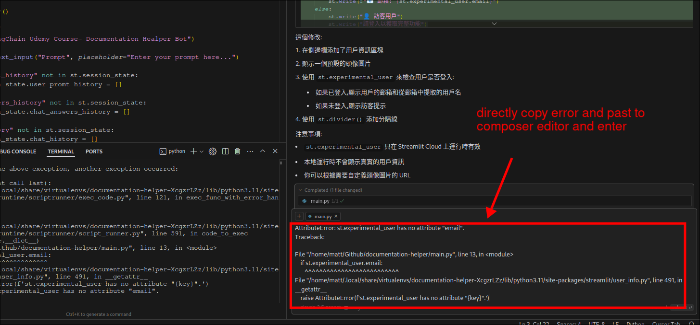

Cursor generates the code to fix the error, then accept it. Now, we check the result on the browser again.

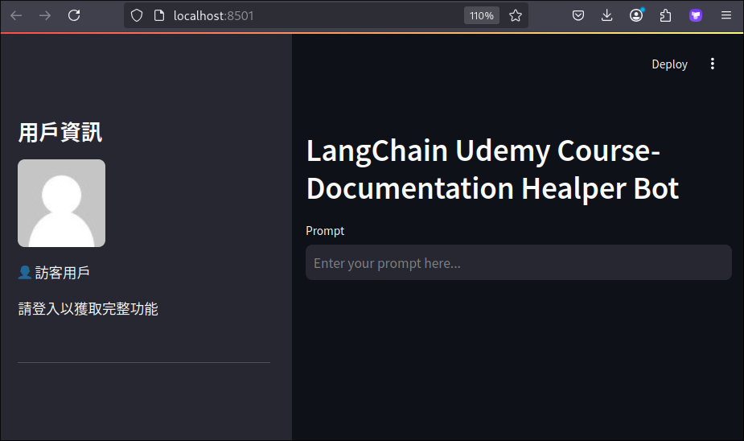

## Copy theme and style from any other website

By using the cursor, we can copy the theme and style from any other website and use it in our project.

1. Open the website you want to copy the theme and style from, and snap a screenshot of the page.

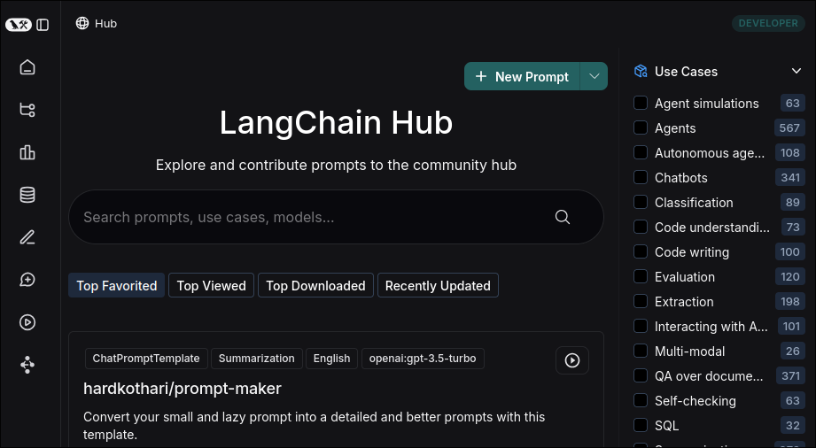

2. Paste the screenshot to the Cursor Composer, and let the cursor know what you want to do.

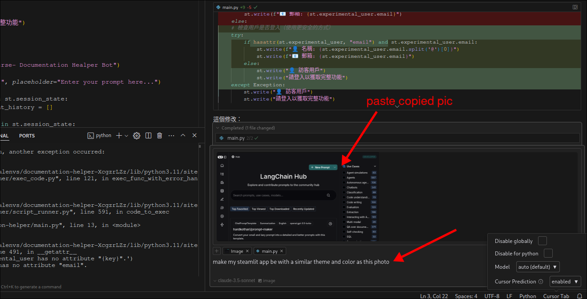

3. Accept the code generated by the cursor, and check the result on the browser.

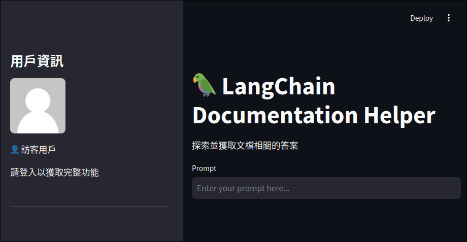

