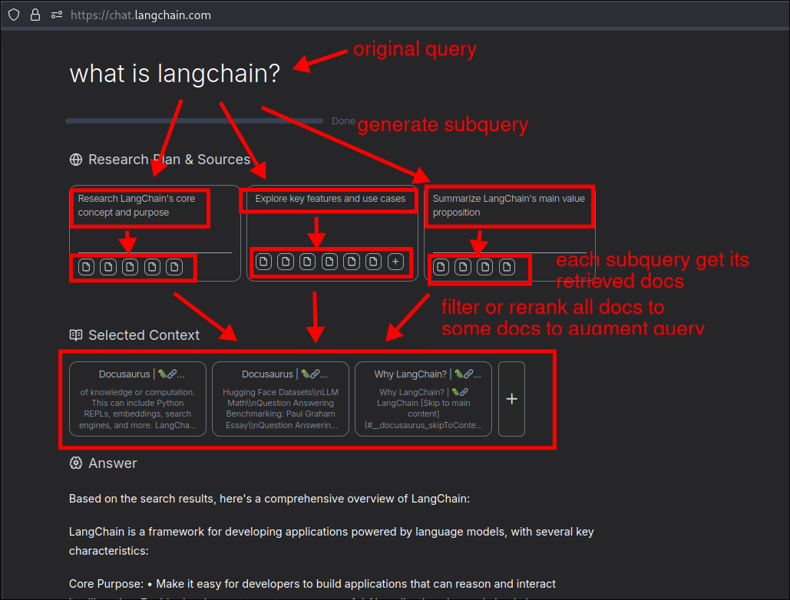
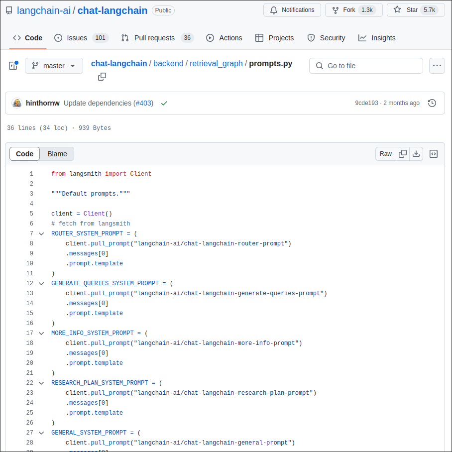

# Documentation Helper in Production

This topic want to show you the project of chat-langchain, which take this prototype that we build in this section and takes it to the next level.

It's impelmenting the paradigm, which is called an Agentic RAG, which is implemented with LangChain, LangGraph.

It has a very elaborate system of curating our query and generating an optimized output that is very usable.

The UI here is very natural and we can really understand what's going on. It's actually called `Generative UI`, which is the art of creating very smooth and nice user interfaces and user experiences for generative applications.

And this web app is actually an open-source project, you can find it on GitHub.

[chat-langchain github](https://github.com/langchain-ai/chat-langchain)

You can find that the prompts it uses are all pulled from LangSmith, which is a great learning example. You can know which prompts it uses.

You can see how prompts are used in the file above, here using a multi-agent system and using LangGraph to implement that.

You can learn multi-agent systems and LangGraph the LangGraph course.

## Why is this important?

Because this is a production-level best example done by the LangChain team, using LangChain, LangGraph, and Next.js to create a complete web app, and it is open source, it is very valuable for reference.

