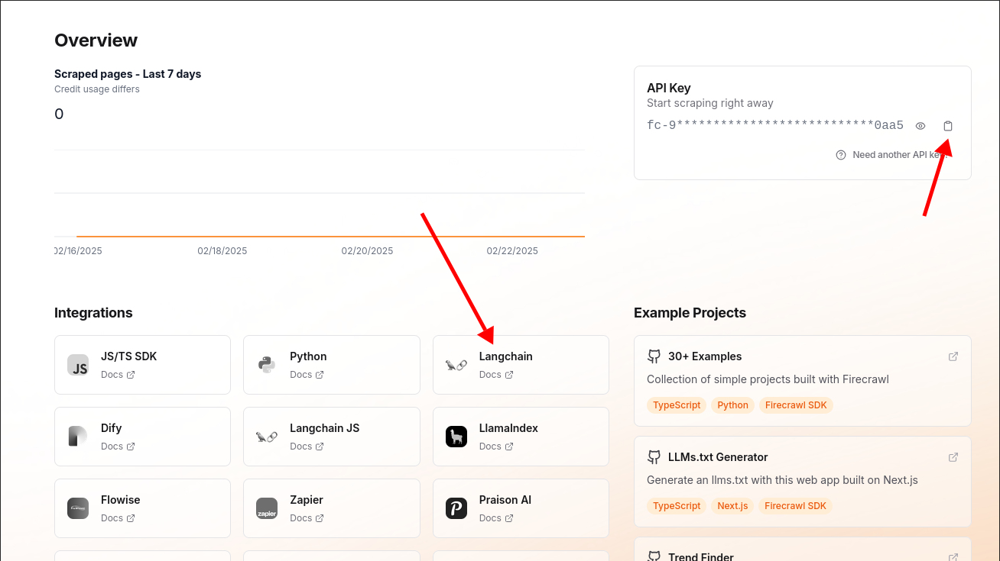
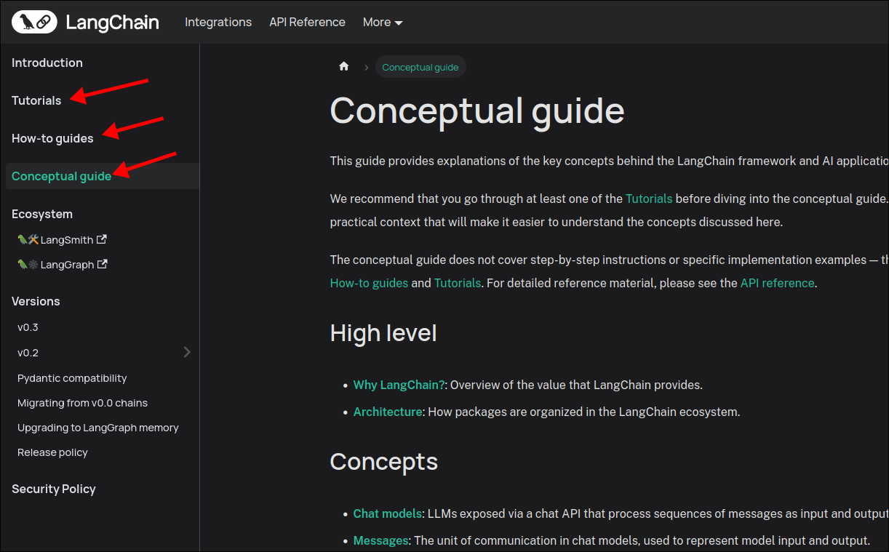
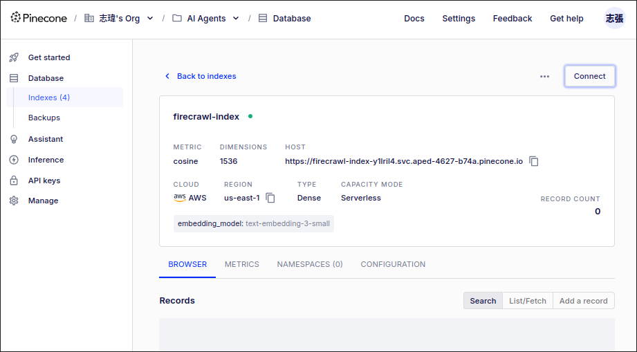

# Optional: RAG Pipline Optimization featuring FireCrawl

This topic should use FireCrawl to crawl website data instead of directly using `wget -r` to crawl, because FireCrawl can help us crawl data more efficiently, avoid being blocked by websites, and automatically parse it into markdown or json format, which is very digestible for LLM.

After signing up for FireCrawl, you can see the dashboard as shown below:




You need to copy the API key and paste it into the `.env` file of the project.

File: /home/matt/Github/documentation-helper/.env
```sh

# ...

FIRECRAWL_API_KEY="fc-92..."
```

And click the `Langchain` button of Integrations section, follow the documentation to install the FireCrawl library and implement the code.

```sh
 pipenv install firecrawl-py
```

File: /home/matt/Github/documentation-helper/ingestion.py
```python
import os
from dotenv import load_dotenv
from langchain.text_splitter import RecursiveCharacterTextSplitter
from langchain_community.document_loaders import ReadTheDocsLoader
from langchain_openai import OpenAIEmbeddings
from langchain_pinecone import PineconeVectorStore

load_dotenv()


embeddings = OpenAIEmbeddings(model="text-embedding-3-small")

def ingest_docs(): ...

# Create a new function to use FireCrawl to crawl the website data
def ingest_docs2() -> None:
    from langchain_community.document_loaders.firecrawl import FireCrawlLoader # Import FireCrawlLoader which wraps the FireCrawl API with Langchain's document loader interface

    # Copy the base URLs from the Langchain documentation website
    langchain_documents_base_urls = [
        "https://python.langchain.com/docs/tutorials/",
        "https://python.langchain.com/docs/how_to/",
        "https://python.langchain.com/docs/concepts/"
    ]

    # Iterate each URL above and use FireCrawl to crawl the website data then add it to Pinecone
    for url in langchain_documents_base_urls:
        print(f"Firing up the FireCrawlLoader for {url}")
        
        # Create a FireCrawlLoader instance with the URL and some options
        loader = FireCrawlLoader(
            url=url,
            mode="crawl", # FireCrawl has three modes: crawl, scrape, and map. We use crawl mode to crawl the website data and its subpages
            params={
                "crawlerOptions": {"limit": 5}, # means only crawl 5 subpages for each URL
                "pageOptions": {"onlyMainContent": True}, # remove the header and footer of the website, only left the main content
                # "wait_until_done": True, # this is asynchronous, so we need to wait until the crawling is done by setting this option to True
                                           # but it will occur an error, so I commit it and it seems still work synchronously already
            }
        )
        docs = loader.load() # start crawling the website data and return the Document objects

        # metadata is very different from the previous one, there is not "source" key but "url" key to store the URL of the document
        # so I need to overwrite the metadata of the document to fit our application
        for doc in docs:
            new_url = doc.metadata["url"]
            doc.metadata = {"source": new_url}

        print(f"Going to add {len(docs)} documents to Pinecone")
        # Add the crawled documents to Pinecone
        PineconeVectorStore.from_documents(
            docs,
            embeddings,
            index_name="firecrawl-index"
            #          ^^^^^^^^^^^^^^^^^ we want to create a new index for the crawled documents by FireCrawl
        )

        print(f"****Loading {url}* to vectorstore done****")


if __name__ == "__main__":
    ingest_docs2()
    #          ^ remember change the function name to the new one

```


## URLs collecting

We usually do not directly give a root URL of a website and let FireCrawl crawl it, because a website contains too much unnecessary information that we do not need. Therefore, it is recommended to first find the URLs we need, and then crawl the information from these URLs.




## Where is the split?

Because the Document quality generated by FireCrawl loader is very good, there is no need to use the RecursiveCharacterTextSplitter TextSplitter to process it, so we can directly add the Document to Pinecone.


## Create new index for crawled documents on Pinecone




## Run the ingestion script!

```sh
 python ingestion.py
Firing up the FireCrawlLoader for https://python.langchain.com/docs/tutorials/

...

```

## Any limits for FireCrawl?

3 requests per minute for the free plan.
