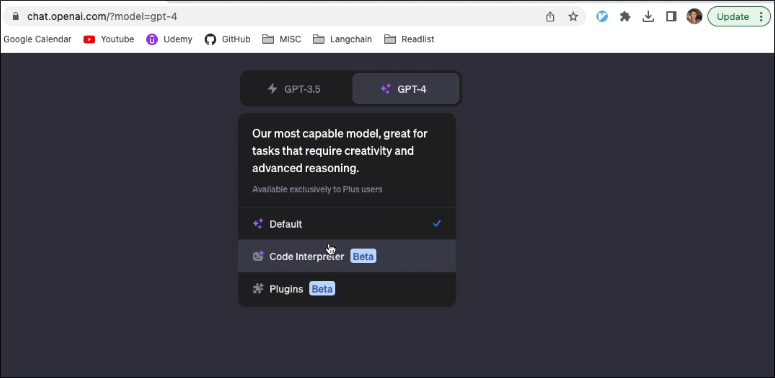
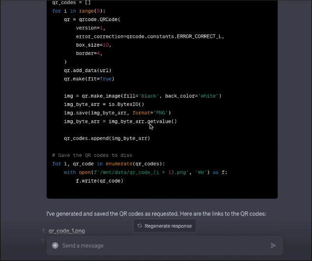
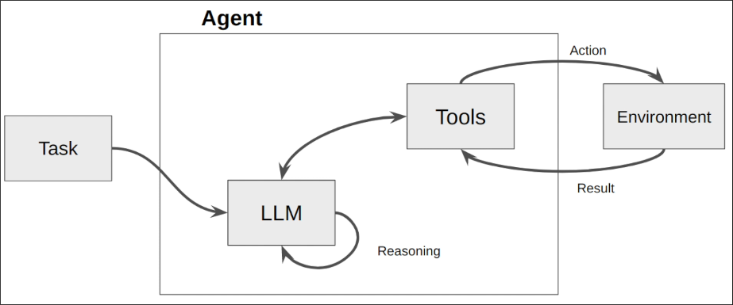
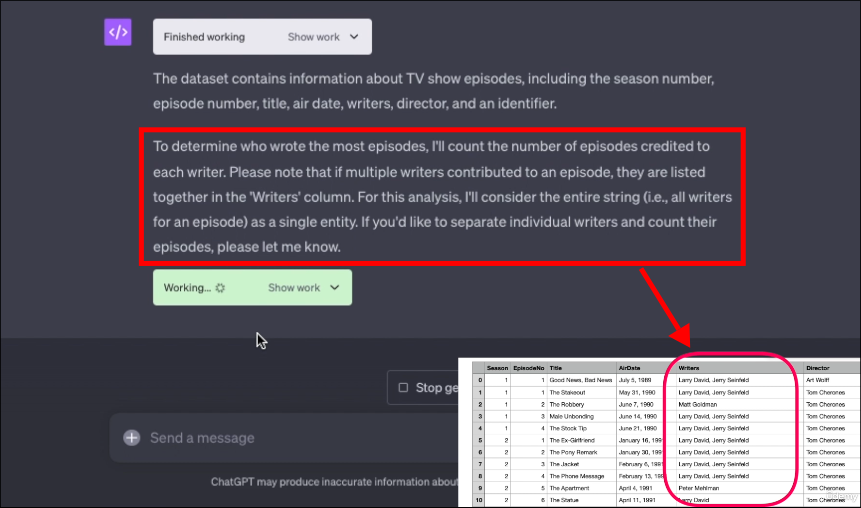
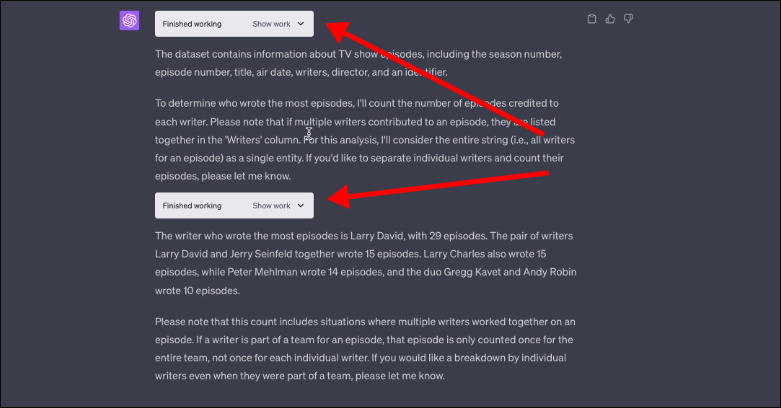
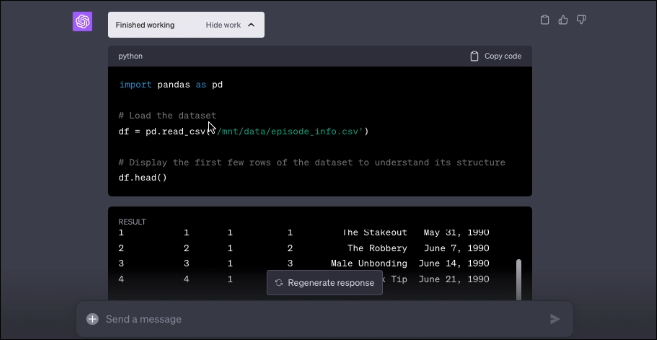
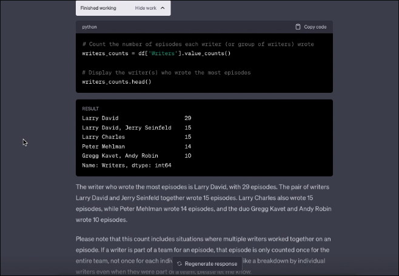

# What are we building? (A slim Version of GPT Code interpreter)

`Code Interpreter` is a feature of the GPT web app. We can directly use it to see what it can do.

Let's input a task and see what it can do.

You can see that GPT has generated some code based on the task, and executing this code has produced results to answer the task.

You can click `Show work` to see the code generated by GPT.

The one actually executing these codes is a tool, while LLM generates codes as input for this tool to execute and returns the output to LLM. The base architecture is like this:

## Parsing CSV to get answer

We look at another example, where we downloaded a CSV of a TV series and uploaded it to a code interpreter, and asked GPT which writer wrote the most episodes.

We can see that GPT initially generates a piece of code, and then presents a disclaimer saying that it will simply calculate the number of occurrences of the same string in the 'Writer' field. If there are multiple writer names in the string, it will not break them down. In this way, the problem becomes much simpler.

We can see that GPT generated two pieces of code above, and we can check the content of these two codes one by one.

The first code above simply uses `pandas` to quickly check the first few lines of a csv file, so that LLM can have a clearer idea of how to handle the task we proposed.

The second code is used to calculate the frequency of the appearance of the writer. This code will extract all the names of the writer, then calculate the frequency of each writer's appearance and return it to LLM. Then, based on this result, LLM answered our question.

## Conclusion

We want to create a slim version of GPT Code Interpreter in this section, this feature allows users to input tasks directly, and then GPT will generate a piece of code to solve the task. This code will be executed by a tool, and then the results will be returned to GPT to answer the task.

