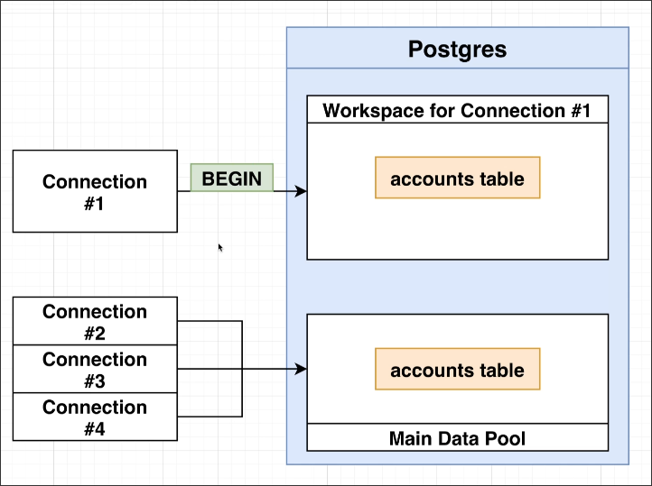
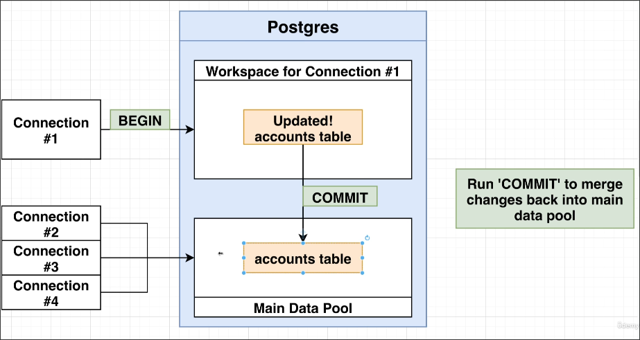
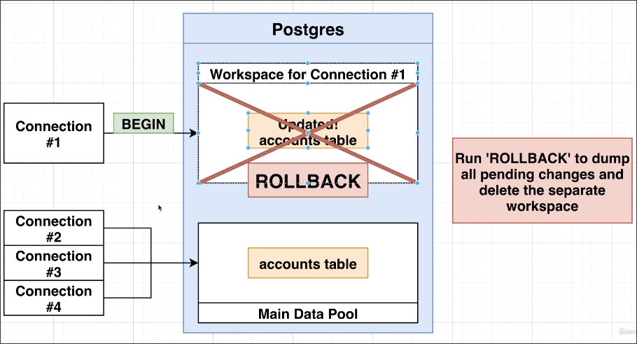
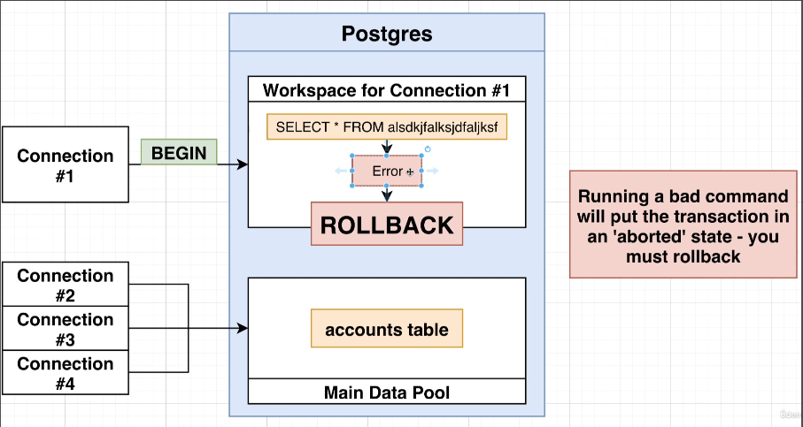
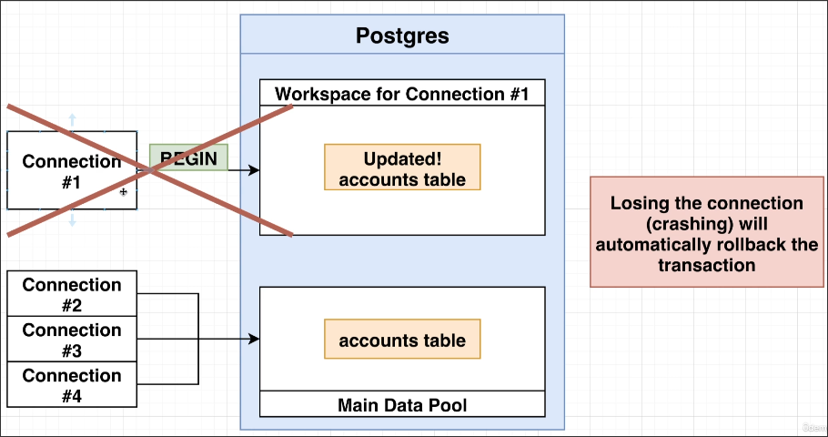

# Opensing and Closing Transactions


*Connection* refers to the external connections coming to the Postgres server. Usually, these connections will connect to the main database workspace, which contains all tables, views, functions, sequences, types, operators, and indexes. Each connection will see the same things.

We sent the following SQL to the Postgres server in one of the connections:

```sql
BEGIN;
```

A copied workspace will be created at this time specifically for this connection to use, and it will not be visible to other connections.



We try to update an account's balance from the same connection:

```sql
UPDATE accounts
SET balance = balance - 50
WHERE name = 'Alyson';
```

Then check the account from another connection:

```sql
SELECT *
FROM accounts;

--- OUTPUT ---
 id |  name  | balance 
----+--------+---------
  1 | Gia    |     100
  2 | Alyson |     100 -- still 100 !?
(2 rows)
```

It proves that the changes only made in the copied workspace, not the main workspace. So only the first connection can see the changes.

Then, we update the `Gia` account's balance from the first connection:

```sql
UPDATE accounts
SET balance = balance + 50
WHERE name = 'Gia';
```

It should be only work on the copied workspace still.

Now the transaction already done, we can use `COMMIT;` to merge the result of the copied workspace back to the main workspace:

```sql
COMMIT;
```

Now, we can see the changes from the second connection:

```sql
SELECT *
FROM accounts;

--- OUTPUT ---
 id |  name  | balance
----+--------+---------
  1 | Gia    |     150
  2 | Alyson |      50
(2 rows)
```




If first connection don't want to UPDATE the second account after the first account has been updated, it can use `ROLLBACK;` to discard the copied workspace:

```sql
ROLLBACK;
```




If any command from the first connection fails or encounters an error, that transaction will become to an aborted state, you need to use `ROLLBACK;` to discard the copied workspace manually.

```sql
ROLLBACK;
```




If the first connection just crashes or lost the connection, the transaction will be automatically aborted, and the copied workspace will be discarded.




Therefore, a transaction will have the above four results at the end.


