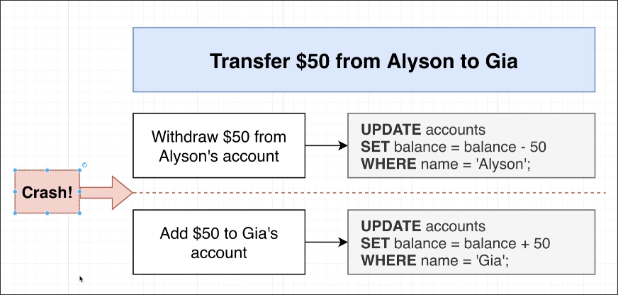

# What are Transactions Used For?

Imagine money transferring between two people. As long as one person hands the money to the other, this is a transaction. However, if it is between two accounts in a database, this process must be written in SQL as follows:

You will find that the SQL above is actually two UPDATE statements, but this will cause a problem where if the first UPDATE is successful and the server crashes, the second UPDATE cannot be executed.

Transaction exists to solve this situation. It can ensure that a set of operations either all execute successfully or none at all. That is, if it is discovered halfway through that the subsequent operations cannot be executed, then the previous operations will also be rolled back, thus ensuring data consistency.

