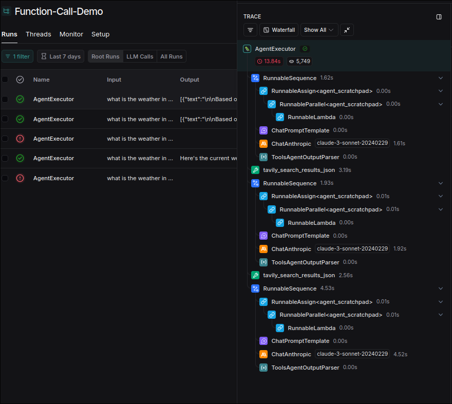

# Function or Tool Calling in LangChain

Previously, our tools information was added to the prompt for LLM to choose to use, but OpenAI allows their LLM to have the functionality of function calling, allowing us to pass in tools using methods, which is more reliable than the prompt method.

Subsequently, Anthropic and Google's models also added the function calling feature, but the implementation methods are different. Fortunately, Langchain helped us integrate them into a unified interface.

```py
from dotenv import load_dotenv
from langchain_anthropic import ChatAnthropic
from langchain_core.prompts import ChatPromptTemplate
from langchain_core.tools import tool
from langchain.agents import create_tool_calling_agent, AgentExecutor
from langchain_openai import ChatOpenAI
from langchain_community.tools.tavily_search import TavilySearchResults

load_dotenv()


# custom tool
@tool
def multiply(x: float, y: float) -> float:
    """Multiply 'x' times 'y'."""
    return x * y


if __name__ == "__main__":
    print("Hello Tool Calling")

    prompt = ChatPromptTemplate.from_messages(
        [
            ("system", "you're a helpful assistant"),
            ("human", "{input}"), # pass `input` when invoke the agent executor
            ("placeholder", "{agent_scratchpad}"), # agent executor will take care of `agent_scratchpad` insides
        ]
    )

    tools = [TavilySearchResults(), multiply] # TravilySearchResults() is a tool that let LLM to search online
    # llm = ChatOpenAI(model="gpt-4-turbo")
    llm = ChatAnthropic(
        model_name="claude-3-sonnet-20240229", 
        temperature=0,
        timeout=None,
        stop=None
    )

    agent = create_tool_calling_agent(llm, tools, prompt)  # create the agent that has calling tools functionality,
                                                           # Langchain provides unified interface for different models

    agent_executor = AgentExecutor(agent=agent, tools=tools) # which is mainly while and take care of lots of things for us

    res = agent_executor.invoke(
        {
            "input": "what is the weather in dubai right now? compare it with San Fransisco, output should in in celsious",
        }
    )

    print(res)
```

Let's see the output of the above code:

```sh

 python main.py
Hello Tool Calling
{'input': 'what is the weather in dubai right now? compare it with San Fransisco, output should in in celsious', 'output': [{'text': '\n\nBased on the sea
rch results, here is a comparison of the weather in Dubai and San Francisco in February 2025:\n\nDubai:\n- Average temperature: Around 23-25°C during the 
day\n- Partly cloudy with minimal rainfall (around 4 days with rain)\n- Winds around 25-35 kph\n\nSan Francisco:\n- Average temperature: Around 14-16°C du
ring the day \n- Overcast with some rainfall (around 4 rainy days)\n- Winds around 15-25 kph\n\nSo in summary, Dubai is quite a bit warmer than San Franci
sco in February, with highs around 25°C compared to 14-16°C in San Francisco. Dubai also has less cloud cover and rainfall. The wind speeds are fairly sim
ilar between the two cities during this month.', 'type': 'text', 'index': 0}]}
```

It's hard to know which tools were used in the above output, let's see the LangSmith's output:



The tool `travily_search_results_json` is called twice before getting the answer.


