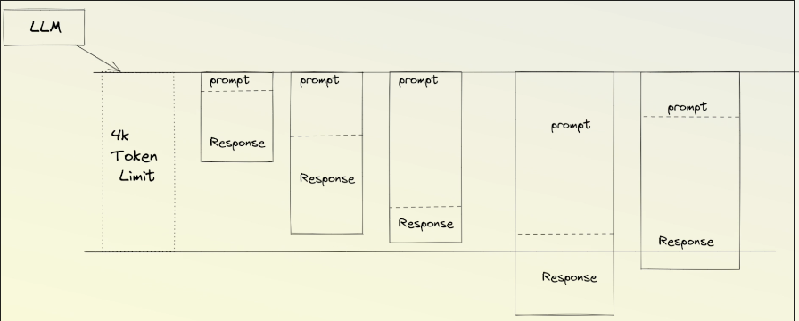
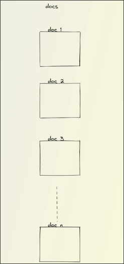
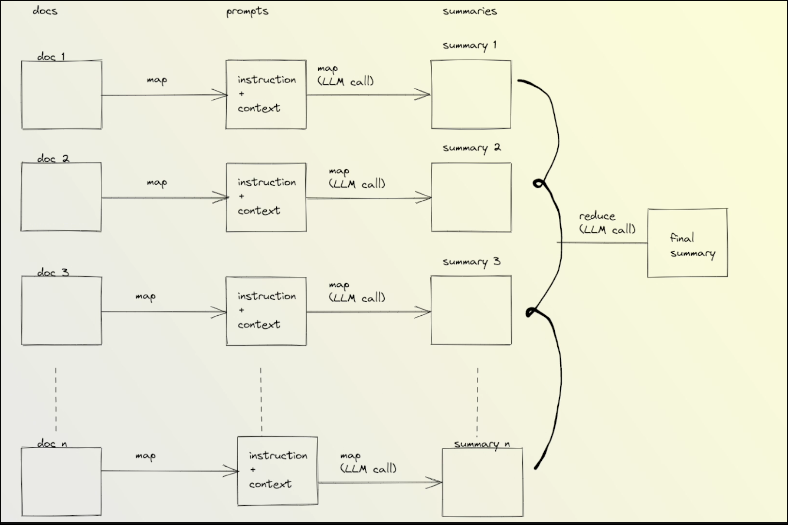
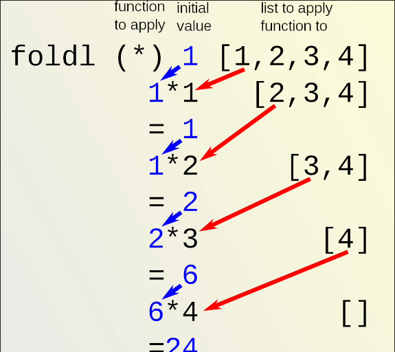

# LangChain Token Limitation Handling Strategies

## LLM has token limit



Token limit is the total sum of tokens in one question and answer session, including both the prompt and the LLM response.

LLM does not care whether there are more tokens for the prompt or the response, as long as the total number of tokens exceeds the limit, an error will be reported.

There are many reasons for exceeding the token limit, such as providing too much context or having a response from the LLM that is too long. We must find a solution.


## Strategies

Langchain provides a chain specifically designed to summarize multiple documents as follows.

```py
from langchain.chains.summarize import load_summarize_chain

docs = [Document(page_content=t) for t in texts[:3]]
chain = load_summarize_chain(llm, chain_type="stuff")
chain.run(docs)
```

We can specify different strategies in the parameter `chain_type` to summarize multiple documents. The following are the strategies we can use:

### stuff


Simply stuffing each document into the summary one by one without any processing. It is very easy to exceed the token limit.


### map_reduce



First, summarize each document using LLM, and then summarize each summary into a single summary using LLM.

Advantages include parallel processing in the middle of the process, while the disadvantage is the repeated calling of LLM.

Moreover, this is the method with the greatest information loss, because there is information loss every time a summary is made. This kind of information loss accumulates, making the final summary less and less related to the original document.


### refine


The meaning is to start with an empty summary and give the first document to LLM to generate a new summary, and so on.


## Conclusion

The strategies above are only specified in the `chain_type` parameter, LangChain will handle the implementation of each strategy under the hood for us.


