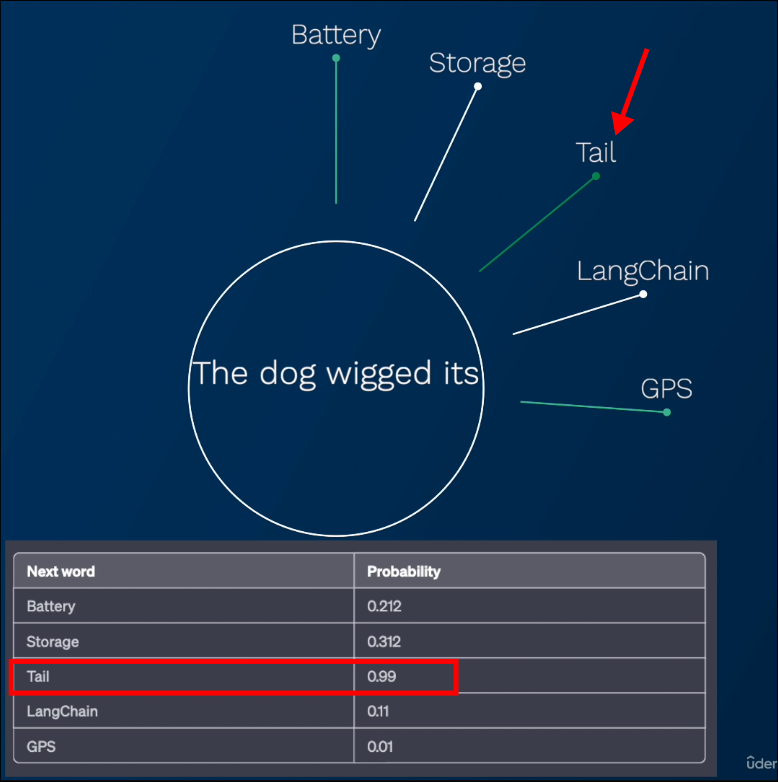
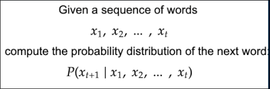

# The GIST of LLMs

## What is Language Model?

**The formal definition from Wikipedia:**
Which talks about a distribution of probability over sequences of words.

**In simple terms:**
What should be the next word = Word with highest probability.

So it just like a super, super smart autocomplete.

We can write it as mathematically as:

P means `probability`, V means `Vocabulary`, x means `word`
It means we give a sequence of words from x1 to xt, and we want to know the probability of the next word xt+1 which comes from the vocabulary V.

## What is LARGE Language Model (LLM)?

**LLM** is a language model that is trained on a large corpus of text data. You can think about it as a language model that is very very good at calculating the probability of the next word in a sentence.

Therefore, LLM also predicts the probability distribution of each word one by one and inputs them one by one.

Sometimes you may feel that LLM's answers are far-fetched, which is related to the way it generates words.
