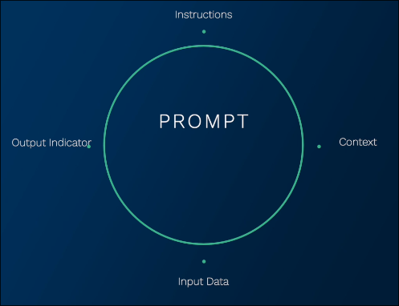
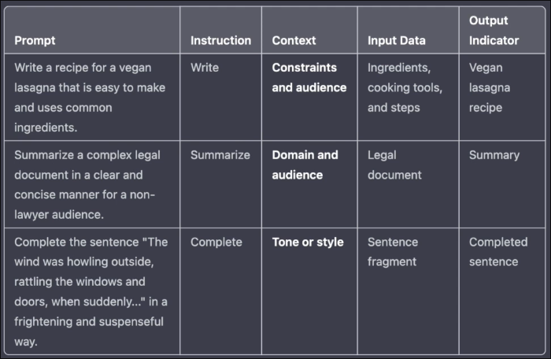
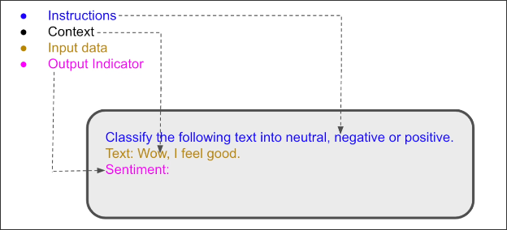

# What is a Prompt? Composition of a formal prompt

 A prompt is the input that we give to the AI model that we wanted to produce an output.

 You can also think of a prompt as a guide for the model, heping it understand the context, to process the information, and to generate a relevant and meaningful response that we can use.

 We're going to break the prompt into four different components:

**Instructions**
You can think about it as the heart of the prompt.

I tells the AI model what task it needs to perform. Wheter you're looking for a text summary, or translation, or classification the instruction sets the stage for the AI's response.

**Context**

It provides additional information that helps the AI model to better understand the task and to generate more accurate responses.

For some tasks, context might not be necessary, while for others, it can significantly improve the AI's performance.

**Input data**
It's the information that the AI model will process in order to complete the task that we've set.

It can be a piece of text, an image, or any data relevant for the task.

**Output Indicator**
It signals the AI model that we expect a response now.

Sometimes the output indicator is implicit in the instruction, but sometimes it's explicit and we'll see example of it very, very soon.

