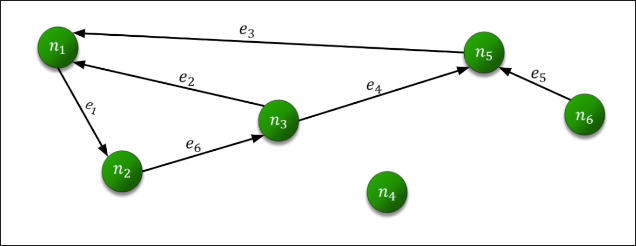
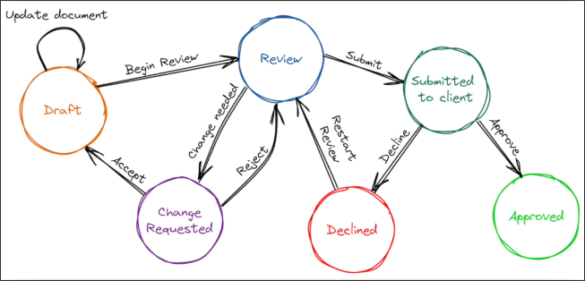

# But wait... What are Graphs?

## Graph

A graph is a `mathematical object` that consists of a set of `vertices (nodes)` and a set of `edges`. Each edge connects a pair of vertices.

There is a lot of research on this data structure and a lot of algorithms and property extraction of those graphs that help use solve a lot of problems in the real world.

## State Machine

It's a `model of computaion` where it consist of `states` and `transitions` between those states, and by defining different states and the rules for the transition between them. It is used to manage complex conditions and sequence in software systems.

We can visualize a state machine as a graph where the nodes are the states and the edges are the transitions between them as shown below.

## LangGraph

With LangGraph, we can describe our flows using a graph structure (nodes and edges) and we can build very powerful and sophisticated agentic applications using it.

