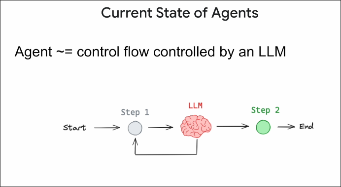
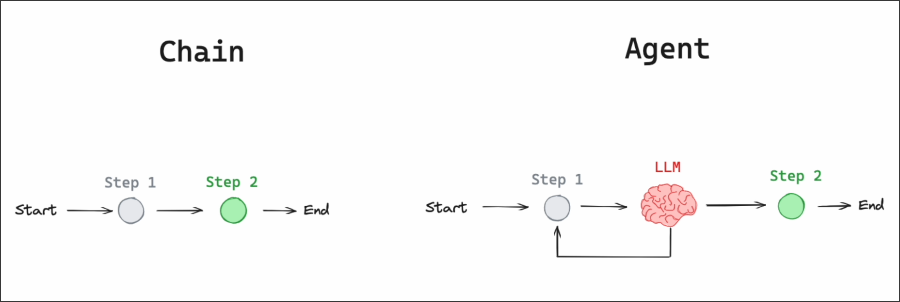
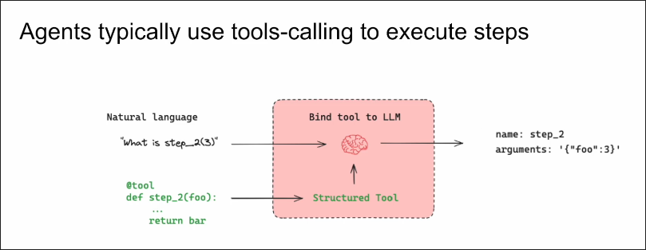
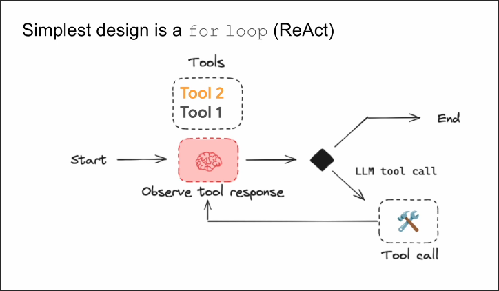

# Current State of Agents

## What is Agent?

The definition of an agent is actually the control flow that allows LLM to decide where to go.

The above figure is a basic example of an agent. We use the reasoning power of an LLM to determine where to go next.

## What different between Agent and Chain?

The chain does not give LLM the ability to make decisions, it simply connects LLM together, but the agent has the ability to make decisions, allowing LLM to determine where to go next.

Therefore, Chain is unidirectional, while there may be some kind of cycle in Agent.

## How does Agent make decisions?

Agents usually execute the next step through function calling.

Below is a basic Agent design pattern. It was first introduced in the ReAct paer.

