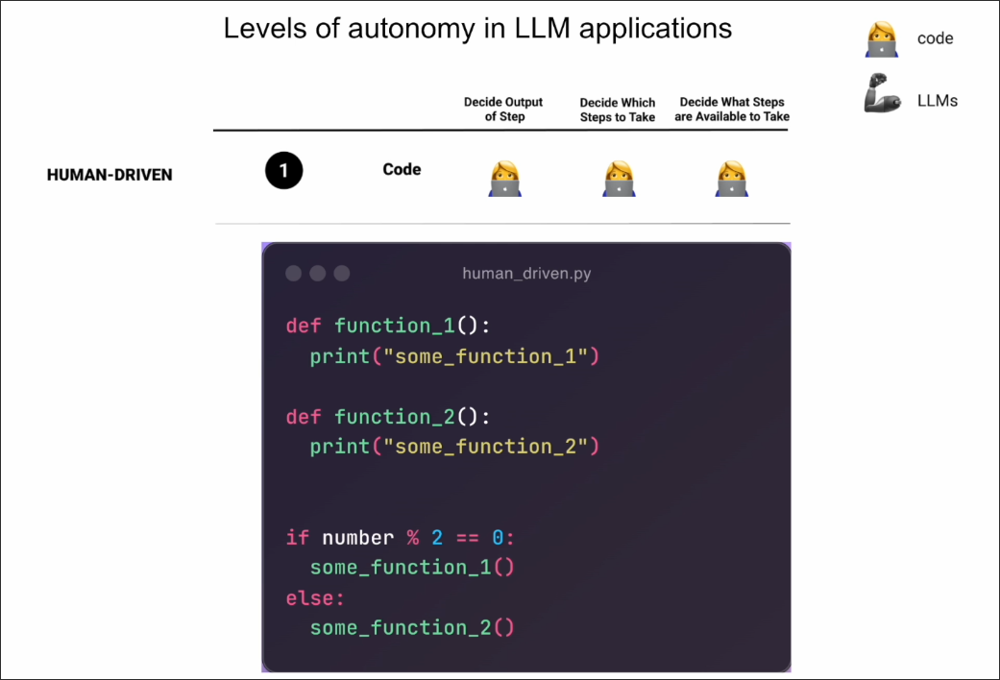
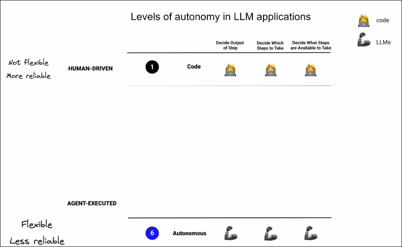
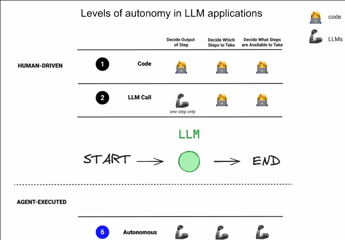
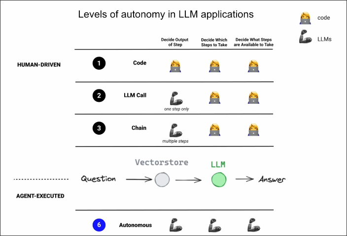
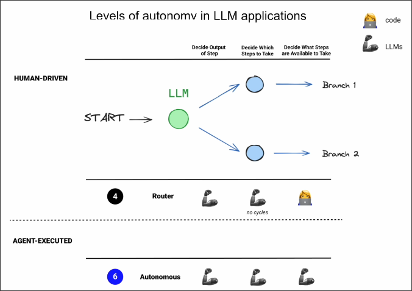
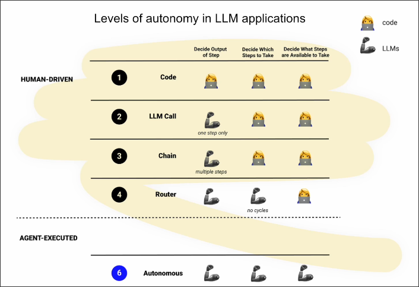
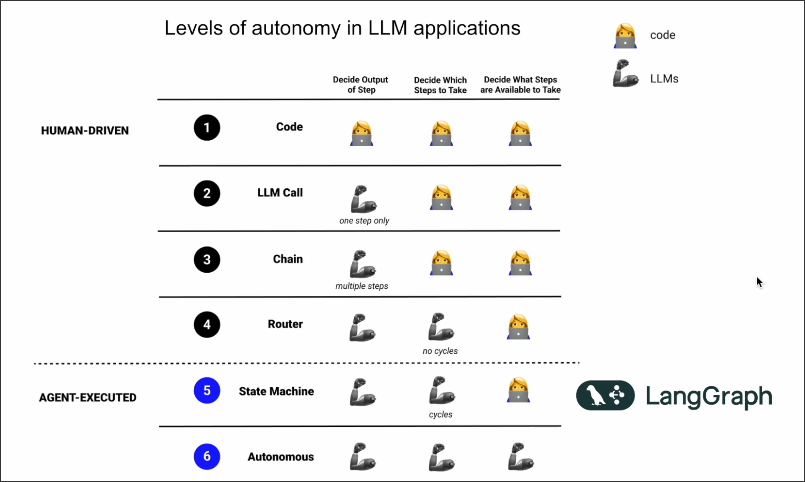

# Different Levels of autonomy in LLM app

Different levels of autonomy in LLM applications

## All codes

As developers, we have full control, so the application is reliable. However, it is not flexible because all hard-coded rules are fixed.

## Autonomous agents

On the other end of the spectrum are `autonomous agents`, which are entirely executed by AI agents from start to finish. Such systems are very flexible, but also very unreliable, as we cannot control the behavior of the agents.

## Adding LLM Call into codes

Using LLM in the app increases flexibility, but both input and output are still controlled by code, so reliability is still very high.

## Adding Chain into codes

Chain is the invocation of multiple LLMs, for example, in the figure above, retriever is called first and then LLM is called to generate the answer. This can increase flexibility. The front and back of the Chain are still controlled by code, so reliability is still very high.

Note that Chain here is one-way and single journey, not circular or branching.

## Adding Router into codes

We use LLM as a router to determine which route to take next, which can increase flexibility, but it results in only some codes being executed, so reliability will decrease.

## Gap between Human-driven and Agent-executed

From Code to Router, LangChain can be applied, but there is a gap between Human-driven and agent-executed.

That gap is where LangGraph comes in.

