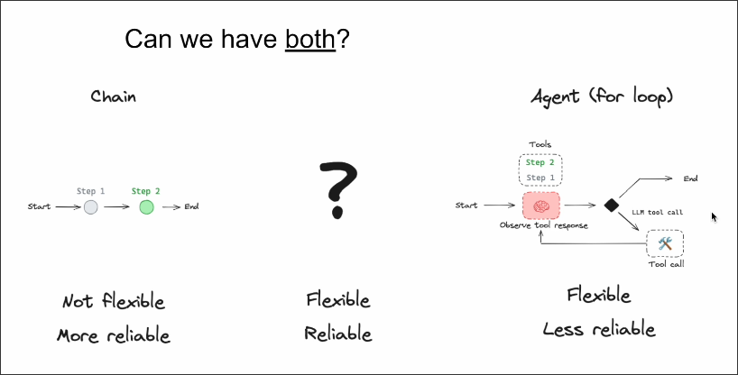
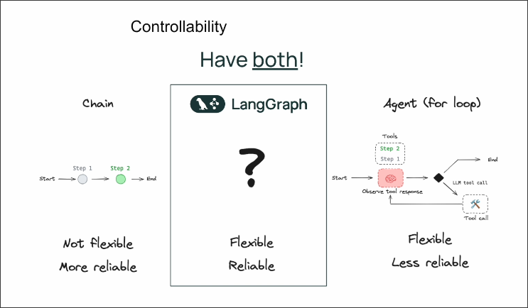
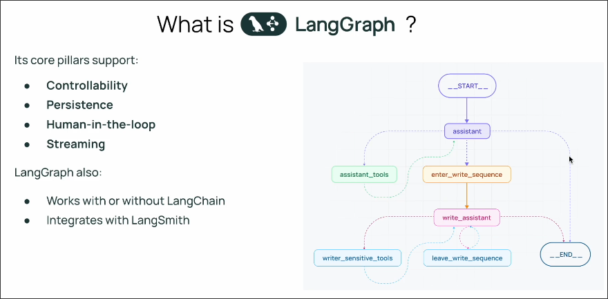
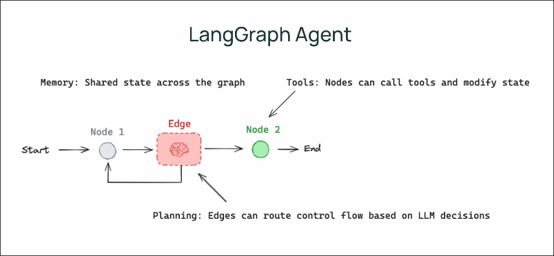

# LangGraph has both flexibility and reliability

## LangGraph has both flexibility and reliability

To solve above question, LangChain team provides LangGraph, a graph-based programming framework that has both flexibility and reliability for LLM applications.

## How LangGraph has both flexibility and reliability?

LangGraph allows developers to define flow, which reduces the degree of freedom of LLM by one dimension, making our system more reliable and easier to test.

LangGraph uses nodes and edges to represent flow, and is a state machine. This design makes our system more reliable and easier to test.

State machine means that there is a state across the nodes and edges, nodes can use the state or mutate the state.

