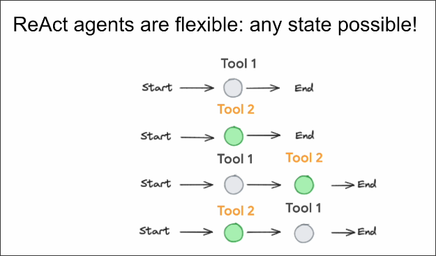
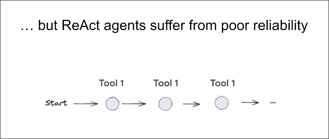
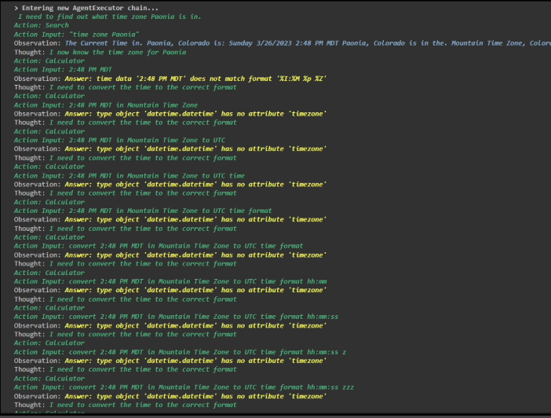
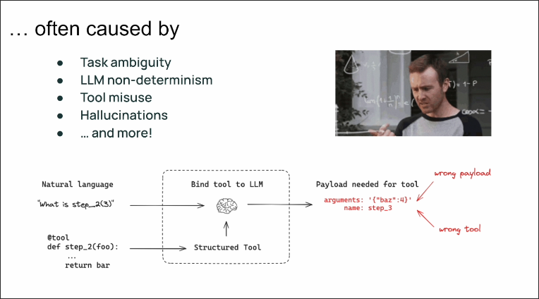
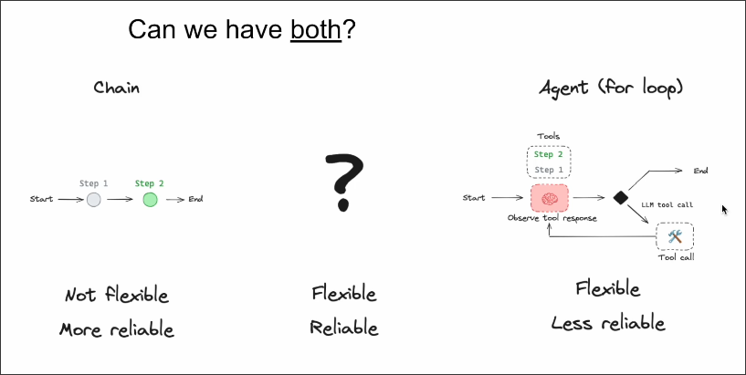

# ReAct agents are TOO flexible!

In Agent, we usually use the ReAct agent to make decisions, determining which Tool (step) to use.

The figure assumes there is a ReAct agent that can use two tools or end directly. We can see that the decision of the ReAct agent is very flexible.

But because it is too flexible, it can lead to the following situations:

There are many reasons for the issues mentioned above, such as unclear tool descriptions, choosing the wrong tool for ReAct agent, or using a tool that does not exist at all...

Our ultimate goal is to have a flexible and reliable method to implement the LLM application.

