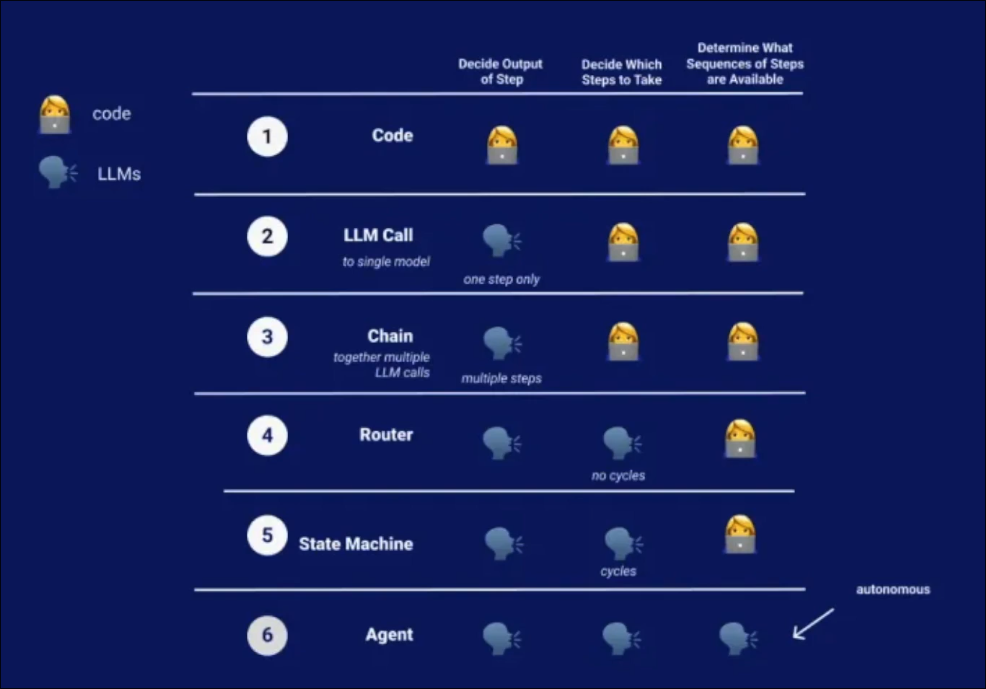
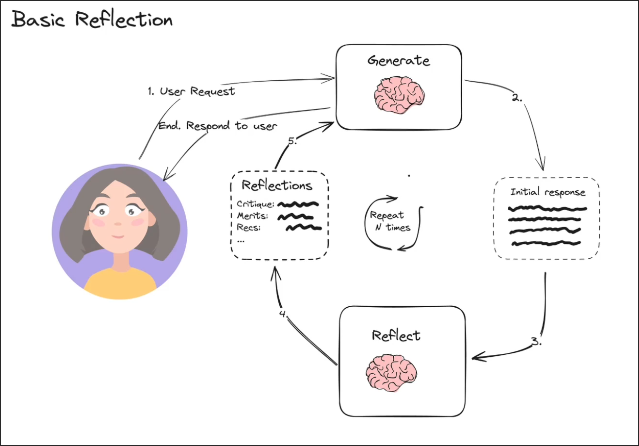

# What is LangGraph

The above figure shows that as the AI model becomes more involved, our control decreases, which is a problem encountered in LangChain.

So LangGraph appears to solve this problem. We can define the flow of our program and we can blend in with LangGraph.

