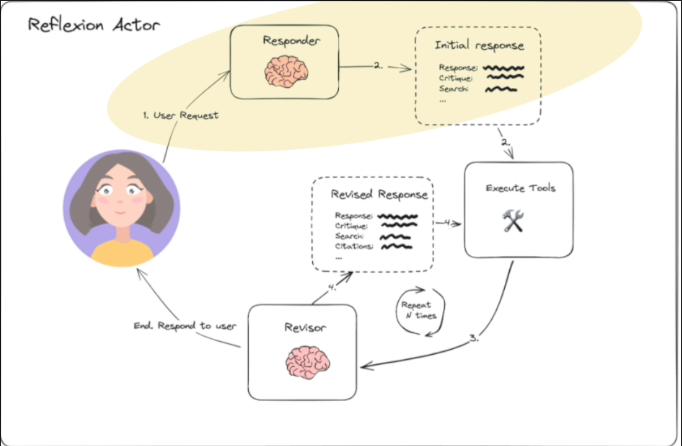

# Actor Agent



this topic, we need to implement the part circled in the above image.

We create a new file `chains.py` to write the prompt and the chain.

```py
import datetime
from dotenv import load_dotenv
from langchain_core.prompts import ChatPromptTemplate, MessagesPlaceholder


load_dotenv()


# this is mainly reusable prompt that we'll use in the Responder and also Revisor chain
actor_prompt_template = ChatPromptTemplate.from_messages(
    [
        (
            "system",
            """You are expert researcher,
Current time: {time}

1. {first_instruction}
2. Reflect and critique your answer. Be severe to maximize improvement.
3. Recommend search queries to research information and improve your answer. """
        ),
        MessagesPlaceholder(variable_name="messages")
    ]
).partial(
    time=lambda: datetime.datetime.now().isoformat()
    # current time will be passed when this prompt is used, which means
    # when the chain is invoked
)

```

To ensure the output of the LLM is in the correct format, we can define a Pydantic model to parse the output.

We create a new file `schemas.py` to define the Pydantic model for the output of the LLM.

```py
from typing import List
from langchain_core.pydantic_v1 import BaseModel, Field


# subclassing BaseModel for AnswerQuestion
class Reflection(BaseModel):
    missing: str = Field(description="Critique of what is missing.")
    superfluous: str = Field(description="Critique of what is superfluous.")
    #                        ^^^^^^^^^^^^^^^^^^^^^^^^^^^^^^^^^^^^^^^^^^^^^^ field description is important for the LLM


# To make the output of the LLM more structured, we can define a Pydantic model and use it as a tool for the LLM
class AnswerQuestion(BaseModel):
    """Answer the question.""" # <--- this is the description of the class, which is important for the LLM

    answer: str = Field(description="~250 word detailed answer to the question.")
    reflection: Reflection = Field(description="Your reflection on the initial answer.")
    search_queries: List[str] = Field(
        description="1-3 search queries for researching improvements to address the critique of your current answer."
    )

```

Then, we can use above model as a tool to bind to the LLM chain in order to force the output of the LLM to be in the format of the Pydantic model.

```py
import datetime
from dotenv import load_dotenv
from langchain_core.output_parsers.openai_tools import (
    PydanticToolsParser # use to parse the output of the LLM to the Pydantic model
)
from langchain_core.messages import HumanMessage # import
from langchain_core.prompts import ChatPromptTemplate, MessagesPlaceholder
from langchain_openai import ChatOpenAI # import 
from schemas import AnswerQuestion # import the Pydantic model we defined


load_dotenv()


llm = ChatOpenAI(model="gpt-4o-mini") # create llm
parser = JsonOutputToolsParser(return_id=True)
parser_pydantic = PydanticToolsParser(tools=[AnswerQuestion])

actor_prompt_template = ChatPromptTemplate.from_messages(
    [
        (
            "system",
            """You are expert researcher,
Current time: {time}

1. {first_instruction}
2. Reflect and critique your answer. Be severe to maximize improvement.
3. Recommend search queries to research information and improve your answer. """
        ),
        MessagesPlaceholder(variable_name="messages")
    ]
).partial(
    time=lambda: datetime.datetime.now().isoformat()
)


# define the first_instruction for the responder agent
first_responder_prompt_template = actor_prompt_template.partial(
    first_instruction="Provide a detailed ~250 word answer."
)

# use LCEL to compose template and llm together to create a responder chain
responder = (
    first_responder_prompt_template
    # force this LLM to use the AnswerQuestion Pydantic model as a tool
    # so it'll output in the format of the Pydantic model
    | llm.bind_tools(tools=[AnswerQuestion], tool_choice="AnswerQuestion")
    # parse the output of the LLM to the Pydantic object because the output of the LLM is in JSON format (LLm only allows to output strings)
    | parser_pydantic
)


if __name__ == '__main__':
    human_message = HumanMessage(
        content="Write about AI-powered SOC / autonomous SOC problem domain, list startups that do that and raised capital."
    )

    res = responder.invoke(input={"messages": [human_message]})
    print(res)

```

Let's run the code and see the output.

```sh
 python chains.py

[
    AnswerQuestion(
        answer="Artificial Intelligence (AI) in the context of Security Operations Centers (SOCs) is revolutionizing the way organizations detect, respond to, and manage security incidents. An AI-powered SOC leverages advanced machine learning algorithms, natural language processing, and data analyt ics to enhance security operations. This technology automates routine tasks, analyzes vast amounts of data for anomalies, and prioritizes alerts based on threat intelligence. The autonomous SOC takes this a step further, enabling systems to respond to incidents without human intervention, thereby reducing r esponse times and mitigating threats more effectively.\n\nThe primary challenges in this domain include ensuring the accuracy of AI detections (to minimiz e false positives), integrating with existing security tools, maintaining data privacy, and adapting to ever-evolving cyber threats. To address these chal lenges, startups have emerged to create innovative solutions. Some notable startups that focus on AI-powered and autonomous SOCs, which have received capi tal funding, include:\n\n1. **Snyk** - specializes in security for the software development lifecycle and has raised over $1 billion.\n2. **Cymulate** - p rovides continuous security validation and has secured approximately $70 million in funding.\n3. **Darktrace** - a leading AI cybersecurity firm well-know n for its autonomous response capabilities, raised $230 million in its latest funding round.\n4. **Vectra AI** - focuses on network detection and response , and has raised about $200 million.\n5. **Chronicle (now part of Google Cloud)** - uses machine learning for security analytics, although specific capita l funding isn't disclosed.\n\nThese startups are at the forefront of integrating AI into SOC operations, significantly enhancing cybersecurity posture for organizations.",
        reflection = Reflection(
            missing = 'While I included relevant startups and the problems they address, I should have elaborated more on specif ic technologies they employ in AI-powered SOCs and provided more concrete examples of incidents they have successfully mitigated or prevented. Also, there was a lack of statistics or current market trends related to AI in cybersecurity.',
            superfluous = 'Some details about general AI capabilities may have take n space away from more specific discussions on market impacts and competitive advantages of the mentioned companies.'),
            search_queries = [
                'AI-powered SOC st artups funding',
                'autonomous SOC technologies',
                'recent innovations in AI cybersecurity',
                'list of funded AI cybersecurity startups'
            ]
        )
    )
]
```

You can see that the Output does indeed conform to the format of the Pydantic model (AnswerQuestion) we defined.
