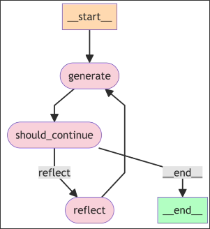
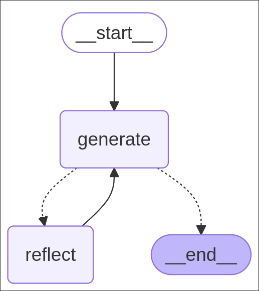

# Defining our LangGraph Graph



We want to define a graph as above in the `main.py` file.

We will use the `generate_chain` created in [[2025-02-27_Creating-the-Reflector-Chain-and-the-Tweet-Revisor-Chain|the previous topic]] in node `generate` and `reflect_chain` in node `reflect` to build this graph.

And we will use the `MessageGraph` as the graph builder. Its state is a list of messages, each node and edge function can accept this state, and must also return a list of messages, which will be appended to the state.

```python
from dotenv import load_dotenv
from typing import List, Sequence
#                        ^^^^^^^^ It's abstract class, it can be implemented by List, Tuple, etc.
#                                 And List is actually a data structure type, a subclass of Sequence
from langchain_core.messages import BaseMessage, HumanMessage
from langgraph.graph import END, MessageGraph
from chains import generate_chain, reflect_chain

load_dotenv()


# define the keys for the nodes
REFLECT = "reflect"
GENERATE = "generate"

# like we said in the previous topic, nodes are actually functions, so we define them as such
def generation_node(messages: Sequence[BaseMessage]) -> List[BaseMessage]:
    return generate_chain.invoke({"messages", messages})
    #                             ^^^^^^^^^^^^^^^^^^^^ it'll be taken by the MessagePlaceholder
    #                                                  and it'll expand the messages in the prompt

def reflection_node(messages: Sequence[BaseMessage]) -> List[BaseMessage]:
    res = reflect_chain.invoke({"messages", messages})
#   ^^^ response from llm should be a AIMessage object
    return [HumanMessage(content=res.content)]
    #      ^^^^^^^^^^^^^^^^^^^^^^^^^^^^^^^^^^^ we need to convert it to HumanMessage, this step is CRUCIAL!!!!!!

builder = MessageGraph() # init a builder object with MessageGraph

# add the nodes to the graph by given key and function
builder.add_node(GENERATE, generation_node)
builder.add_node(REFLECT, reflection_node)

# connect the node START to the node GENERATE
builder.set_entry_point(GENERATE)

# create a function contains the logic of the conditional edge
def should_continue(state: Sequence[BaseMessage]):
#                   ^^^^^^^^^^^^^^^^^^^^^^^^^^^^ it also accepts the state of the graph
    if len(state) > 6:
        return END
    return REFLECT

# create the conditional edge by given the from node key, the function of the conditional edge
builder.add_conditional_edges(GENERATE, should_continue)

# create the edge from REFLECT to GENERATE (it builds a cycle)
builder.add_edge(REFLECT, GENERATE)

# complie the builder to a graph which we can use
graph = builder.compile()


# print the graph in mermaid format or ascii format
print(graph.get_graph().draw_mermaid())
print(graph.get_graph().draw_ascii())  # this one need package `grandalf` to be installed


if __name__ == "__main__":
    print("Hello, World!")

```

Let's run this code and see the graph in the mermaid and acsii format.

```sh
 python main.py
%%{init: {'flowchart': {'curve': 'linear'}}}%%
graph TD;
        __start__([<p>__start__</p>]):::first
        generate(generate)
        reflect(reflect)
        __end__([<p>__end__</p>]):::last
        __start__ --> generate;
        reflect --> generate;
        generate -.-> reflect;
        generate -.-> __end__;
        classDef default fill:#f2f0ff,line-height:1.2
        classDef first fill-opacity:0
        classDef last fill:#bfb6fc

          +-----------+
          | __start__ |
          +-----------+
                *
                *
                *
          +----------+
          | generate |
          +----------+
          ***        ...
         *              .
       **                ..
+---------+           +---------+
| reflect |           | __end__ |
+---------+           +---------+
Hello, World!

```

We can copy paste the mermaid code to the [mermaid live editor](https://mermaid.live/)



There are some points to note in the code above:

**Replace the response from the reflect_chain with HumanMessage**
In this way, the last message received by generation_node will be a HumanMessage, not an AIMessage. generation_node must make LLM believe that the last message is a HumanMessage in order to function correctly.

**The LLM of reflect_chain still get messages with the last message as a AIMessage**
In fact, the LLM of reflect_chain can still function properly even if the last message is an AIMessage. Converting the response of reflect_chain into a HumanMessage is done to maintain the alternation of HumanMessage and AIMessage in the state's messages.
