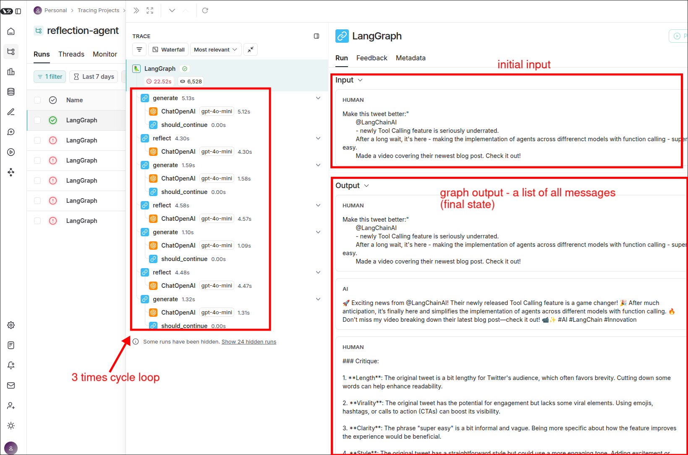

# LangSmith Tracing

Let's actually run the graph we've been building in [[2025-02-27_Defining-our-LangGraph-Graph|the previous topic]].

```py 
from dotenv import load_dotenv
from typing import List, Sequence
from langchain_core.messages import BaseMessage, HumanMessage
from langgraph.graph import END, MessageGraph
from chains import generate_chain, reflect_chain

load_dotenv()


REFLECT = "reflect"
GENERATE = "generate"

def generation_node(messages: Sequence[BaseMessage]):
    return generate_chain.invoke({"messages": messages})

def reflection_node(messages: Sequence[BaseMessage]) -> List[BaseMessage]:
    res = reflect_chain.invoke({"messages": messages})
    return [HumanMessage(content=res.content)]
    

builder = MessageGraph()
builder.add_node(GENERATE, generation_node)
builder.add_node(REFLECT, reflection_node)

builder.set_entry_point(GENERATE)

def should_continue(state: Sequence[BaseMessage]):
    if len(state) > 6:
        return END
    return REFLECT

builder.add_conditional_edges(GENERATE, should_continue)
builder.add_edge(REFLECT, GENERATE)

graph = builder.compile()

if __name__ == "__main__":
    # Create a human message as initial input
    inputs = HumanMessage(content="""Make this tweet better:"
        @LangChainAI
        - newly Tool Calling feature is seriously underrated.
        After a long wait, it's here - making the implementation of agents across diffrerenct models with function calling - super easy.
        Made a video covering their newest blog post. Check it out!""")

    # Run the graph with the initial input
    response = graph.invoke(inputs)

```


Run the script, and then you can check the result on the LangSmith dashboard.



We can see that the graph output is the final state which is the list of messages in this case, and Human messages and AI messages appear alternately. This is because we convert the return message of the node 'reflection_node' into 'HumanMessage'.


