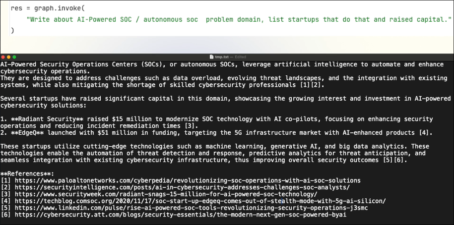
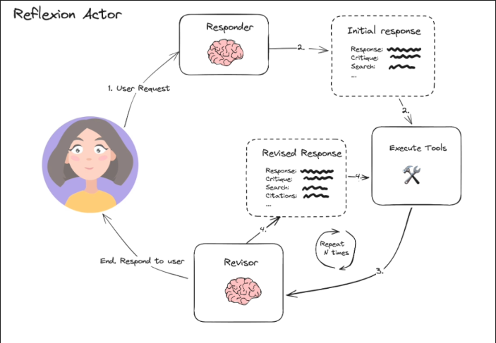

# What are we building?

We want to create a Reflexion agent similar to the reflection agent we made before, but with the addition of a tool that can search online.

We will also review some advanced prompt engineering techniques in order for our reflexion agent to be able to digest the feedback correctly and to really address and improve through the iterations, because to create a critique, it's not that hard, but to really leverage the LLM to incorporate that critique and to improve over time is something which is challenging.

The goal of Reflexion agent is go give us a very details artical about a topic we given to it, and we want the article to dynamically fetch relevant information from the internet and we want to have citations for the references.

The input and output of the Reflexion agent is as follows:

Our Reflexion agent flow is as follows:

There will be a Responder node using LLM to generating an initial response, which includes not only an article but also a critique and a search query. This search query will be used to send to the Tool node to search for information on the internet, and then form a cycle with a Revisor node which uses LLM to continue searching for data and improving the article. This feedback loop will continue until the quality of the article reaches a satisfactory level.

