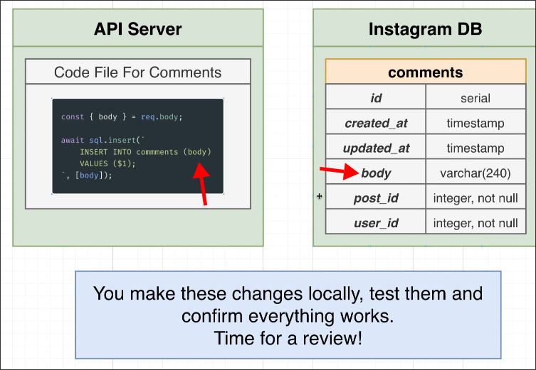
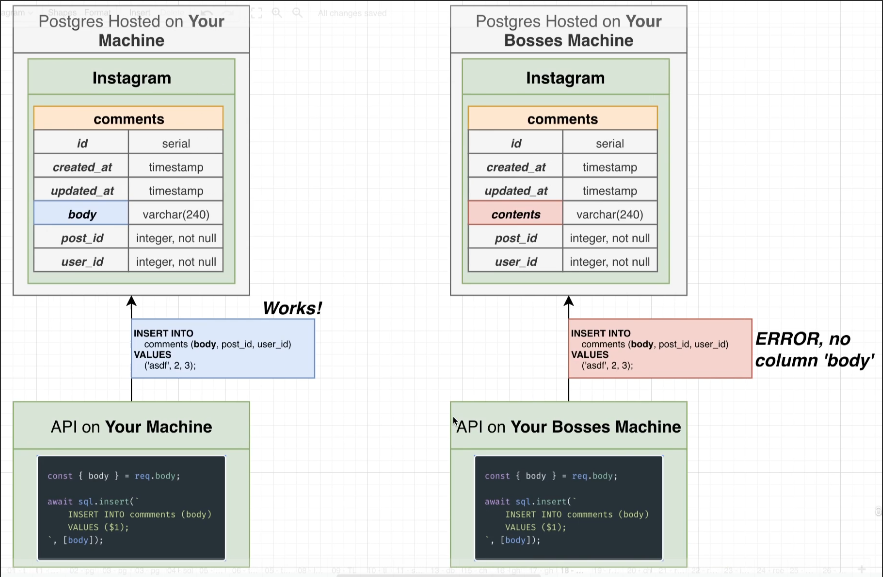
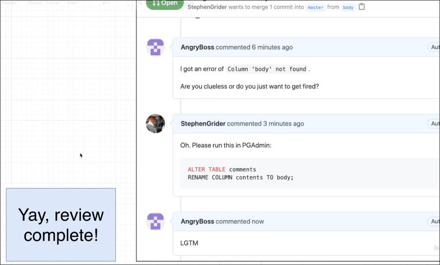
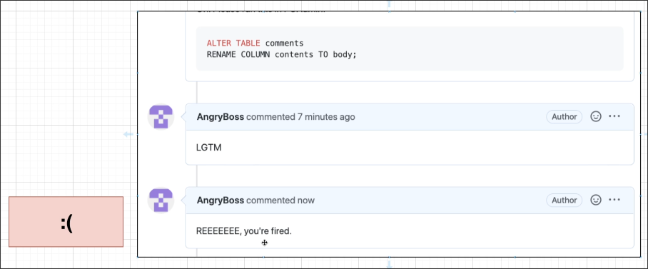

# Different DB between different engineers

We continue the story of [[2025-02-28_Window-between-DB-and-Clients|the previous topic]].

After you discovered the mistake, you immediately changed the column name in the production database back to `contents`. However, at this point, your manager is already very angry and orders you to be responsible for not only the comments table but also all related APIs, and any modifications on the API server must undergo code review.

And you still need to change the column name from `contents` to `body`...

You make change to both the API server and the database in the local, and it seems to work fine.

Then, you post on the Github PR for the code review. This time, your manager is going to review the code himself.

But he found that your codes don't work as expected...

You found that because the manager's local database is different from your local database, the column of his table comments has not been modified.

So you send the SQL script to him, and let him execute it to modify his database by himself.

The manager executed the test successfully and gave you an LGTM.

Just when you thought the code review was completed and ready to be deployed to production, your manager suddenly decides to revert your API code update on his local PC himself. However, after reverting it, his local application is no longer functioning properly...

Although it is obvious that the manager forgot to change the column name in his local database back, he may think that everything is a problem with your code.

## Big Lesson #2

> Whenever you are working with other engineers, it is extremely important that you have a very easy way to tie the structure of your database or changes to the structure of your database, to your code as well

So whenever someone checks out or kind of looks at a particular version of your code or your application server, they need to somehow make sure that they've got the correct structure of the database as well.

