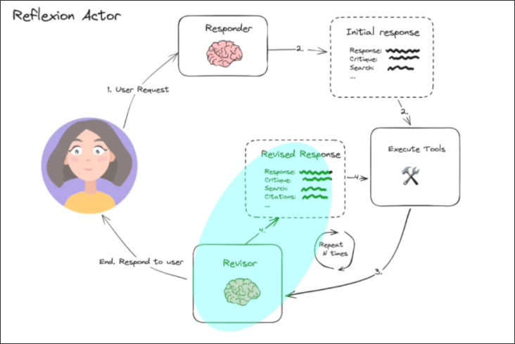
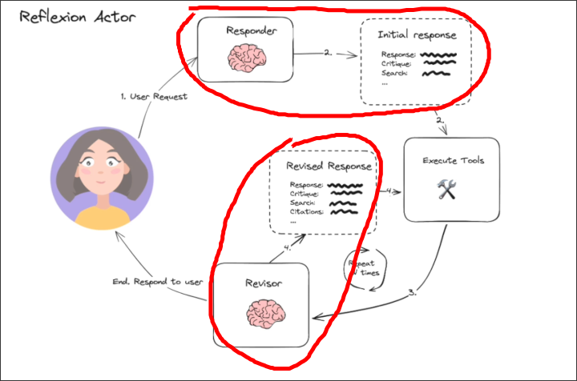

# Revisor Agent



In this topic, we will implement the Revisor Agent, because it uses the main prompt created in [[2025-02-27_Actor-Agent|the previous topic]] and we will inherit the output model of the Responder agent to create a new output model for the Revisor agent, so this topic will be relatively simple.

File: /home/matt/Projects/reflexion-agent/chains.py
```python
import datetime
from dotenv import load_dotenv
from langchain_core.output_parsers.openai_tools import (
    PydanticToolsParser
)
from langchain_core.messages import HumanMessage
from langchain_core.prompts import ChatPromptTemplate, MessagesPlaceholder
from langchain_openai import ChatOpenAI
from schemas import AnswerQuestion


load_dotenv()


llm = ChatOpenAI(model="gpt-4o-mini")
parser = JsonOutputToolsParser(return_id=True)
parser_pydantic = PydanticToolsParser(tools=[AnswerQuestion])

# We will use the same prompt here but with a different instruction for the revisor
actor_prompt_template = ChatPromptTemplate.from_messages(
    [
        (
            "system",
            """You are expert researcher,
Current time: {time}

1. {first_instruction}
2. Reflect and critique your answer. Be severe to maximize improvement.
3. Recommend search queries to research information and improve your answer. """
        ),
        MessagesPlaceholder(variable_name="messages")
    ]
).partial(
    time=lambda: datetime.datetime.now().isoformat()
)


first_responder_prompt_template = actor_prompt_template.partial(
    first_instruction="Provide a detailed ~250 word answer."
)

responder = (
    first_responder_prompt_template
    | llm.bind_tools(tools=[AnswerQuestion], tool_choice="AnswerQuestion")
    | parser_pydantic
)

# Create the instruction for the revisor, which is different from the responder
revice_instructions = """Revise your previous answer using the new information.
    - You should use the previous critique to add important information to your answer.
    - You MUST include numerical citations in your revised answer to ensure it can be verified.
    - Add a "References" section to the bottom of your answer (which does not count towards the word limit). In form of:
        - [1] https://example.com
        - [2] https://example.com
    - You should use the previous critique to remove superfluous information from your answer and make SURE it is not more than 250 words."""

```

Then, we go to `schemas.py` and add the new Pydantic model for the Revisor agent output:

```py
from typing import List
from langchain_core.pydantic_v1 import BaseModel, Field


class Reflection(BaseModel):
    missing: str = Field(description="Critique of what is missing.")
    superfluous: str = Field(description="Critique of what is superfluous.")


class AnswerQuestion(BaseModel):
    """Answer the question."""

    answer: str = Field(description="~250 word detailed answer to the question.")
    reflection: Reflection = Field(description="Your reflection on the initial answer.")
    search_queries: List[str] = Field(
        description="1-3 search queries for researching improvements to address the critique of your current answer."
    )

# Create new model which inherits from AnswerQuestion to revise the answer
class ReviseAnswer(AnswerQuestion):
#                  ^^^^^^^^^^^^^^ inherits from AnswerQuestion
    """Revise your original answer to your question.""" # <--- Description for reviser agent
    # The output of the reviser agent will be the same as the responder agent, but with the addition of the references field which is a list of citations
    references: List[str] = Field(
        description="Citations motivating your updated answer."
    )

```

Now, we can use the model and the instruction to create the Revisor agent in the `chains.py` file:

```python
import datetime
from dotenv import load_dotenv
from langchain_core.prompts import ChatPromptTemplate, MessagesPlaceholder
from langchain_openai import ChatOpenAI
from schemas import AnswerQuestion, ReviseAnswer
#                                   ^^^^^^^^^^^^ Import the new model from schemas.py


load_dotenv()


llm = ChatOpenAI(model="gpt-4o-mini")
parser = JsonOutputToolsParser(return_id=True)
parser_pydantic = PydanticToolsParser(tools=[AnswerQuestion])

actor_prompt_template = ChatPromptTemplate.from_messages(
    [
        (
            "system",
            """You are expert researcher,
Current time: {time}

1. {first_instruction}
2. Reflect and critique your answer. Be severe to maximize improvement.
3. Recommend search queries to research information and improve your answer. """
        ),
        MessagesPlaceholder(variable_name="messages")
    ]
).partial(
    time=lambda: datetime.datetime.now().isoformat()
)


first_responder_prompt_template = actor_prompt_template.partial(
    first_instruction="Provide a detailed ~250 word answer."
)

responder = (
    first_responder_prompt_template
    | llm.bind_tools(tools=[AnswerQuestion], tool_choice="AnswerQuestion")
    # | parser_pydantic  # This is not needed here, we'll use parser in the `main.py` instead
)

revice_instructions = """Revise your previous answer using the new information.
    - You should use the previous critique to add important information to your answer.
    - You MUST include numerical citations in your revised answer to ensure it can be verified.
    - Add a "References" section to the bottom of your answer (which does not count towards the word limit). In form of:
        - [1] https://example.com
        - [2] https://example.com
    - You should use the previous critique to remove superfluous information from your answer and make SURE it is not more than 250 words."""

# Create revisor agent with LCEL
revisor = (
    actor_prompt_template.partial(first_instruction=revice_instructions) # Use the new instruction for the revisor
    | llm.bind_tools(tools=[ReviseAnswer], tool_choice="ReviseAnswer") # same as responder, but with the new model
)

```

Our two agents, 'responder' and 'revisor', have now been set up. We will use these two agents in the graph later.




