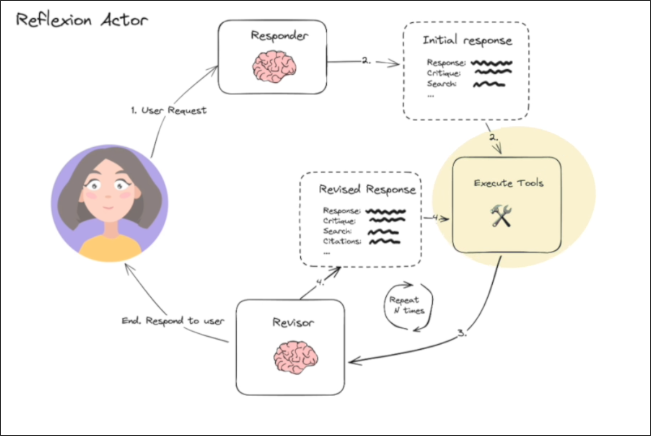

# Tool Executor Agent (Part A)



In this topic, we started implementing the node `Execute Tools`, the purpose of this node is to execute tools to search for information on the internet based on the search_queries in the last AIMessage, and then add the results as ToolMessage to the state.

Here we only define the function signature and the test code for debugging purposes. The actual functionality will be implemented in the next topic.

Let's create a new file called `tool_executor.py` and add the following code:

```py
from typing import List
from dotenv import load_dotenv
from langchain_core.messages import AIMessage, BaseMessage, HumanMessage, ToolMessage
from schemas import AnswerQuestion, Reflection


load_dotenv()


# In this topic, we just define the function signature, and this function is for the node `Execute Tools`
def execute_tools(state: List[BaseMessage]) -> List[ToolMessage]:
#                                                   ^^^^^^^^^^^ this is the interface for the result of the tool execution,
                                                               # it treats the result as a kind of message, that we can append to the state
    tool_invocation: AIMessage = state[-1] # get the last message in the state, it should be the AIMessage that contains the tool call
                                           # and we only care about the search queries inside it


# Bellow we mimic the input state for the tool executor, we will use this to test the tool executor in the follow topics
if __name__ == "__main__":
    print("Tool Executor Enter")

    # initial message
    human_message = HumanMessage(
        content="Write about AI-Powered SOC /autonomous SOC problem domain, list startups that do that and raised capital."
    )

    # This is not actually the output of the first responder agent, just the model of the output
    # we will use this to compute the output of the first responder agent bellow
    answer = AnswerQuestion(
        answer="",
        reflection=Reflection(missing="", superfluous=""),
        search_queries=[
            "AI-Powered SOC startups funding",
            "AI SOC problem domain specifics",
            "Technologies used by AI-Powered SOC startups",
        ],
        id="call_KpYHichFFEmLitHFvFhKy1Ra", # this is added by the LLM vendor automatically
    )

    raw_res = execute_tools(
        # mimic the state to the node `Execute Tools`
        state=[
            human_message, # the input message
            AIMessage( # the output message of the first responder agent
                content="", # we don't care about the content of the first responder agent output here, so we leave it empty string
                # the tool call that we care about, when LLM using function calling, there must be a `tool_calls` field in the message
                tool_calls=[
                    {
                        # here we use the `AnswerQuestion` class to compute the content of the tool call easily
                        "name": AnswerQuestion.__name__,
                        "args": answer.dict(),
                        "id": "call_KpYHichFFEmLitHFvFhKy1Ra", # this is the same id as the `answer` object, to identify the tool and its output
                    }
                ]
            )
        ]
    )


