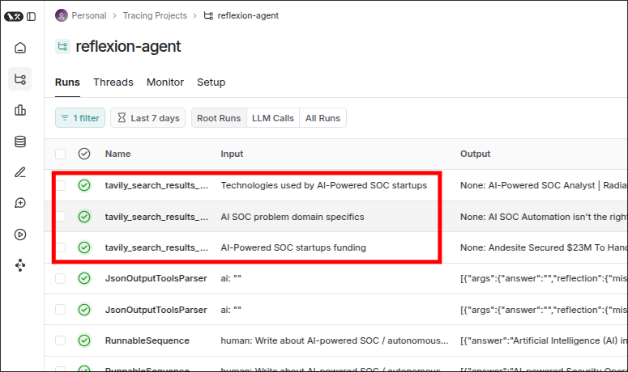

# Tool Executor Agent (Part B) _update!

In new version of LangGraph, the Tool Invocation and Tool Executor are deprecated. So some codes in [[2025-02-28_Tool-Executor-Agent-(Part-B)|the previous topic]] already outdated.

```py
...

# from langgraph.prebuilt import ToolInvocation, ToolExecutor

load_dotenv()


search = TavilySearchAPIWrapper(tavily_api_key=os.environ["TAVILY_API_KEY"])
tavily_tool = TavilySearchResults(api_wrapper=search, max_results=5)
# tool_executor = ToolExecutor([tavily_tool])

def execute_tools(state: List[BaseMessage]) -> List[ToolMessage]:
    tool_invocation: AIMessage = state[-1]
    parsed_tool_calls = parser.invoke(tool_invocation)

    # ids = []
    # tool_invocations = []

    for parsed_call in parsed_tool_calls:
        for query in parsed_call["args"]["search_queries"]:
            # tool_invocations.append(ToolInvocation(
            #     tool="tavily_search_results_json",
            #     tool_input=query,
            # ))
            # ids.append(parsed_call["id"])

    # outputs = tool_executor.batch(tool_invocations)


if __name__ == "__main__": ...

```

We should directly call the `tavily_tool` to get the results and build the `ToolMessage` object in each iteration.

```py
...

search = TavilySearchAPIWrapper(tavily_api_key=os.environ["TAVILY_API_KEY"])
tavily_tool = TavilySearchResults(api_wrapper=search, max_results=5)

def execute_tools(state: List[BaseMessage]) -> List[ToolMessage]:
    tool_invocation: AIMessage = state[-1]
    parsed_tool_calls = parser.invoke(tool_invocation)

    outputs = [] # because we don't use ToolExecutor anymore, so we need to append the result one by one to the list

    for parsed_call in parsed_tool_calls:
        for query in parsed_call["args"]["search_queries"]:

            # invoke the tool to get the results from the Tavily API
            search_results = tavily_tool.invoke(query)

            # append the results to the outputs list
            outputs.append(tool_message)


if __name__ == "__main__":
    print("Tool Executor Enter")

    human_message = HumanMessage(
        content="Write about AI-Powered SOC /autonomous SOC problem domain, list startups that do that and raised capital."
    )

    answer = AnswerQuestion(
        answer="",
        reflection=Reflection(missing="", superfluous=""),
        search_queries=[
            "AI-Powered SOC startups funding",
            "AI SOC problem domain specifics",
            "Technologies used by AI-Powered SOC startups",
        ],
        id="call_KpYHichFFEmLitHFvFhKy1Ra",
    )

    raw_res = execute_tools(
        state=[
            human_message,
            AIMessage(
                content="",
                tool_calls=[
                    {
                        "name": AnswerQuestion.__name__,
                        "args": answer.dict(),
                        "id": "call_KpYHichFFEmLitHFvFhKy1Ra",
                    }
                ]
            )
        ]
    )
```

Run the code and check the result in the LangSmith.



We can see that the tool `tavily_search_results_json` was called three times with different queries.

And then, check the output of a tool execution in the LangSmith.

```yaml
 output:
  - url: https://www.evalueserve.com/the-ultimate-guide-to-domain-specific-ai-ebook/
    content: Businesses benefit from domain-specific AI in several ways, including more reliable outcomes, time to impact, pre-trained data from multiple industry parties, and scaling across the enterprise with more use cases. Domain-specific AI designs algorithms and models to resolve specific challenges for a particular industry, function, and use case. Deep experiences in the financial sector, manufacturing, consumer-packaged goods, energy, technology, and professional services provides Evalueserve a deep understanding of the full spectrum of potential domain-specific AI use cases. AI becomes domain-specific when the data science team begins training the AI model with industry-specific training data. Evalueserve aligned with the software company on a use case to deploy a sophisticated domain-specific AI model that would streamline customer segmentation to lifetime value and upsell product recommendations.
  - url: https://ai4sp.org/domain-specific-knowledge-graphs-and-ai-for-good/
    content: Domain-Specific Knowledge Graphs and AI for Good - AI4SP.org Domain-Specific Knowledge Graphs and AI for Good AI has the potential to play a major role in this process, and the development of domain-specific knowledge graphs could be a major step forward in leveraging AI for social progress. AI for Social Progress and Economic Growth - AI Compass - AI4SP AI Compass, AI Compass for Businesses, AI Compass for Nonprofits, Sustainability Management Compass, Digital Skills Compass, AI and Digital Maturity Compass - SMB AI Center - Nonprofit AI Center, Copilot Ada, and AI4SP are trademarks of LLY Group LLC and its subsidiary AI4SP LLC
  - url: https://thehackernews.com/2025/02/soc-30-evolution-of-soc-and-how-ai-is.html
    content: "Let's take a look at how the earliest SOCs handled alert triage and remediation, detection & correlation, threat investigation and data processing. SOC teams still scramble to keep up with new threats, new data sources, and the overhead of maintaining automation frameworks. While the volume of data required to fuel AI-driven security grows, SOC 3.0 relies on a more intelligent approach to data storage and querying: Ingesting, understanding, and triaging alerts from any security vendor or data source, Radiant ensures no real threats are missed, cuts response times from days to minutes, and enables analysts to focus on true positive incidents and proactive security."
  - url: https://www.institutedata.com/us/blog/what-is-problem-domain-and-solution/
    content: What is Problem Domain and Solution in Software Engineering? What is Problem Domain and Solution in Software Engineering? In the field of software engineering, problem domain and solution is a key factor for successful software development. AI analytics Application artificial intelligence big data Business Business and Technology business intelligence Business Training Career Advice career change Career Development career path case study Cyber attack Cyber attacks Cyber News Cybersecurity cyber security Data Analysis data analytics data science data science Data Science & AI data skills design Digital marketing General Tech Interview Job Hunting Job opportunities machine learning Marketing & Advertising Personal Development PPC & Advertising Project management seo_manual Software architecture software design software development Software Engineering Student Services Team development Tech skills upskilling
  - url: https://franklyspeaking.substack.com/p/ai-soc-automation-isnt-the-right
    content: AI SOC Automation isn't the right problem to solve Frankly Speaking AI SOC Automation isn't the right problem to solve AI SOC Automation isn't the right problem to solve Frankly Speaking AI SOC Automation isn't the right problem to solve In a previous newsletter, I mentioned that many companies are working on applying AI to the SOC, and that was a topic for another newsletter. I’ve spent some time thinking about the SOC and how AI could possibly modernize it. I have also talked to the founders of some AI SOC Analyst companies, such as Prophet Security, Culminate, and Dropzone AI, to learn more about their products and thinking.   type: AnswerQuestion

```

Each result of tavily_tool.invoke(query) has 5 objects with the `url` and `content` fields because we set the `max_results=5` in the `TavilySearchResults` object.
So the `outputs` list is a nested list of 3 lists, each list contains 5 objects which is the same as the old version of the code.
