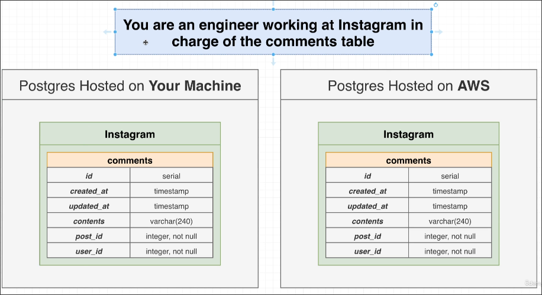
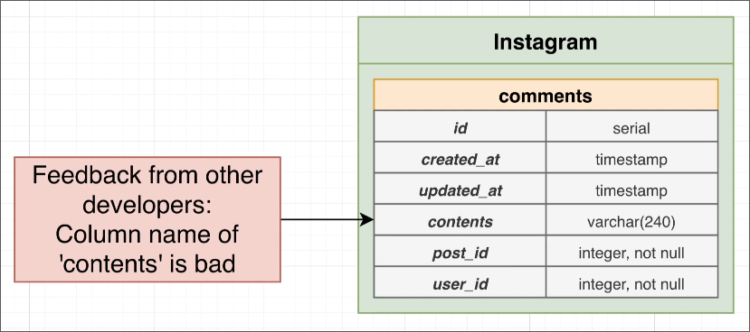
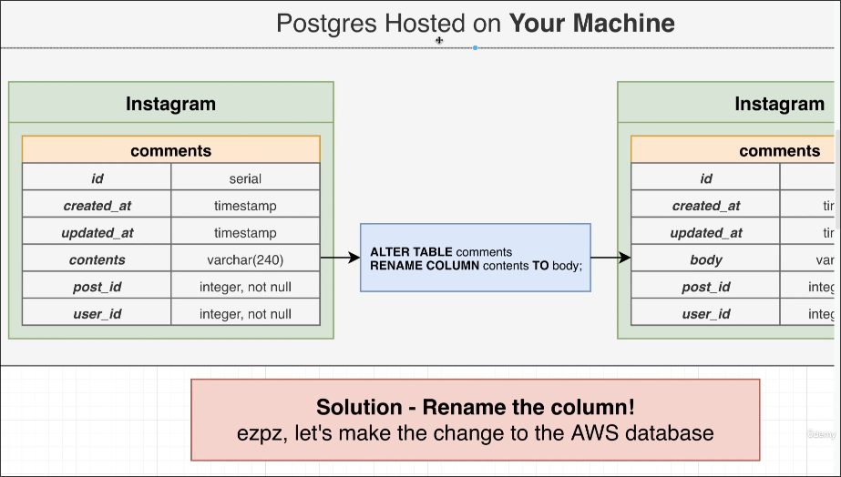
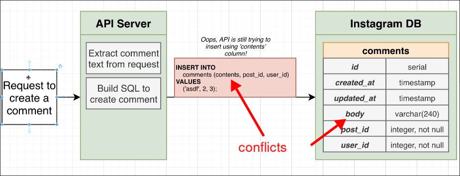
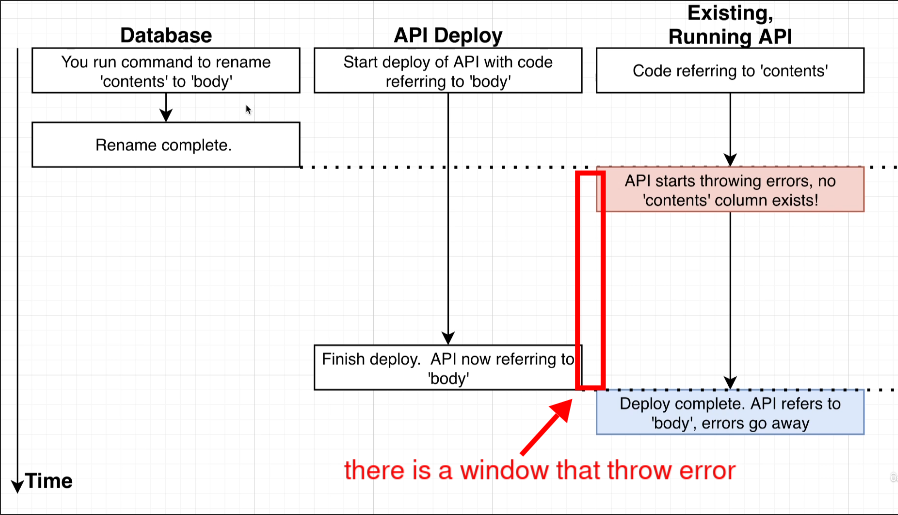

# Window between DB and Clients

We're going to pretend that you are an engineer working at Instagram in charge of managing their database.

And maybe on this on particular day that you have to make a couple of changes to the structure of the database.

And well, if you just make those changes directly to the database, we're going to see that some really big issues start to arise very quickly.

Here we are pretending that you are in charge of specifically the comments table. That's all.

You have two databases, one for production and one for development.

One day, the developer told you that the column name `contents` in this table is easily confused with the table name `comments` and often requires attention to whether an `s` needs to be added. They hope that it can be renamed.

So you think that just changing the column name `contents` to `body` is enough, this is a very inexpensive, very fast, and very easy operation inside of Postgres.

You executed this ALTER in the local environment without any errors, and then you thought that this operation is safe, so you sent this SQL to production for execution.

After you make that change, sirens start going off in your office, alarm bells are going off and you start getting emails that there are some critical errors coming out of your application.

And so chances are it's all tied to that rename of that column of contents over to body.

What's wrong?? Why are there errors at all??

Because there will be many connections to the database performing operations related to the comments table, like in the example above where the client operations used in the application backend's API server still use the column name `contents`, but it has been changed to `body` in the database, so an error will occur.

So, what should you do?

## Big Lesson #1

> Changes to the DB structure and changes to clients need to be made at precisely the same time.

So in other words, if we change that contents column over to body inside of our comments table, we need to make sure it just about the same time we make that change, all of our different clients, such asa an API server.

However, compared to SQL ALTER, API deployment is a slow process, which may take several minutes. This can result in a window where the database and API server are not in sync, causing errors until the API server deployment is complete.

In addition, in large companies, databases and API servers are usually managed by different teams, which can lead to more challenges.

Some companies choose to temporarily stop application services in order to perform this operation, so as not to cause users to encounter errors.

However, there are some companies that cannot choose to let the application go down, for example, companies with a certain service level agreement (SLA) guaranteeing service availability. They must ensure that the service remains operational for the vast majority of the time.

We will discuss some technical solutions later on, so that this window can be minimized, ensuring that no database changes in any scenario will cause errors to occur.

