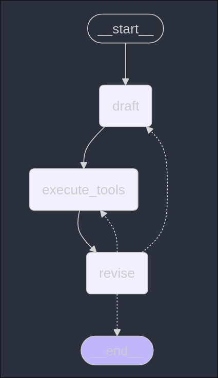
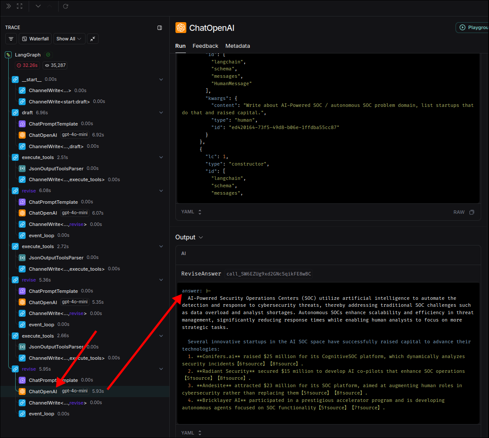

# Building our LangGraph Graph

In the previous topic, we have already created the functions needed for each node (responder, revise, tool_executor). Next, we will create a graph to connect these nodes in the file `main.py`.

```py
from dotenv import load_dotenv
from typing import List
from langchain_core.messages import BaseMessage, ToolMessage
from langgraph.graph import END, MessageGraph

# import functions of nodes we previously created
from chains import responder, revisor
from tool_executor import execute_tools


load_dotenv()


MAX_ITERATIONS = 2 # set a limit to the number of times the tool_executor node can be visited

builder = MessageGraph()

builder.add_node("draft", responder)
builder.add_node("execute_tools", execute_tools)
builder.add_node("revise", revisor)

builder.add_edge("draft", "execute_tools")
builder.add_edge("execute_tools", "revise")

# create the function for the conditional edge, it also accepts the state as an argument like regular nodes' functions,
# but returns a string which is the name of the next node.
def event_loop(state: List[BaseMessage]) -> str:
    # Because each cycle will generate a new tool message in the state, we can count the number of tool messages in the state
    # to determine how many times thy cycle has been executed.
    count_tool_visits = sum(isinstance(item, ToolMessage) for item in state)
    if count_tool_visits > MAX_ITERATIONS: # so it should stop after 3 tool calls
        return END
    return "execute_tools" # otherwise, it should continue to execute tools

builder.add_conditional_edges("revise", event_loop)
builder.set_entry_point("draft")

graph = builder.compile()

graph.get_graph().draw_mermaid_png(output_file_path='graph.png')
#                 ^^^^^^^^^^^^^^^^ we can directly draw the mermaid graph to a file by this method


if __name__ == '__main__':
    print('Hello, world!')

```




The graph looks the same as we expected, so we can start invoking this graph.

```py
...

graph = builder.compile()


if __name__ == '__main__':
    print("Hello Reflexion")
    res = graph.invoke(
        "Write about AI-Powered SOC / autonomous SOC problem domain, list startups that do that and raised capital."
    )

```

We can view the final answer by checking the output of LangSmith's last revisor.




