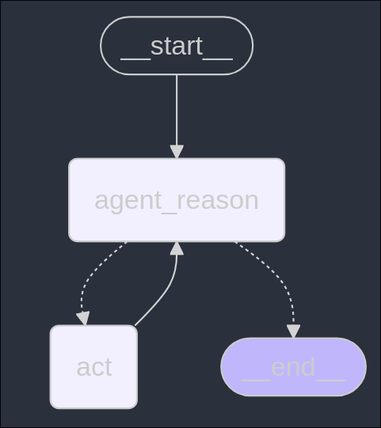
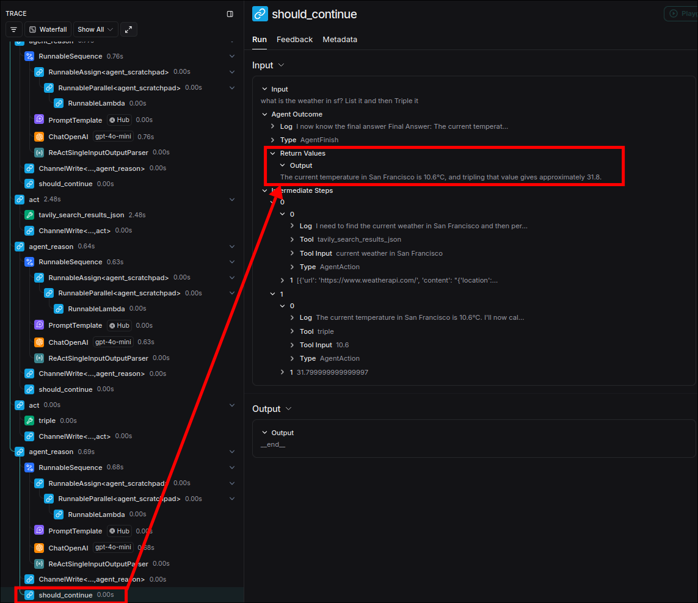

# Graph

In this topic, we will combine the things prepared in the previous topics into a graph in the file `main.py`.

```py
from dotenv import load_dotenv
from langchain_core.agents import AgentFinish
from langgraph.graph import StateGraph, END
#                           ^^^^^^^^^^ accept the custom state schema (TypedDict) and return a builder object of the graph
from langgraph.prebuilt import ToolNode # to convert the list of tools into a single node directly

from nodes import run_agent_reasoning_engine # the fn of node `agent_reason` we prepared in the previous topic
from state import AgentState # the custom state schema we prepared in the previous topic
from react import tools # the tools ([TavilySearchResults(max_results=1), triple]) we prepared in the previous topic


load_dotenv()

# define the nodes' keys
AGENT_REASON = "agent_reason"
ACT = "act"

# create the graph builder object with our custom state schema,
# which includes the attributes `input`, `agent_outcome` and `intermediate_steps`
flow = StateGraph(AgentState)

# add the nodes to the graph
flow.add_node(AGENT_REASON, run_agent_reasoning_engine)
flow.add_node(ACT, execute_tools)

# connect START -> AGENT_REASON
flow.set_entry_point(AGENT_REASON)

# write the logic for the conditional edges
def should_continue(state: AgentState) -> str:
    if isinstance(state["agent_outcome"], AgentFinish): # when the ReAct agent output is `AgentFinish` object
        return END                                      # it means it should go to the end of the graph
    return ACT                                          # otherwise, it should continue to use one of the tools

flow.add_conditional_edges(AGENT_REASON, should_continue) # create the conditional edge with the above logic
flow.add_edge(ACT, AGENT_REASON) # create the edge: ACT -> AGENT_REASON, which creates a loop


# compile the graph
graph = flow.compile()

# print the graph in the mermaid format
print(graph.get_graph().draw_mermaid())

# %%{init: {'flowchart': {'curve': 'linear'}}}%%
# graph TD;
#         __start__([<p>__start__</p>]):::first
#         agent_reason(agent_reason)
#         act(act)
#         __end__([<p>__end__</p>]):::last
#         __start__ --> agent_reason;
#         act --> agent_reason;
#         agent_reason -.-> act;
#         agent_reason -.-> __end__;
#         classDef default fill:#f2f0ff,line-height:1.2
#         classDef first fill-opacity:0
#         classDef last fill:#bfb6fc

```



Let's add the user input to invoke the graph:

```py
...

graph = flow.compile()


if __name__ == "__main__":
    print("Hello ReAct with LangGraph!")
    res = graph.invoke(
        input={
            "input": "what is the weather in sf? List it and then Triple it"
        }
    )

```

And run the script and check the last output on the LangSmith dashboard:


