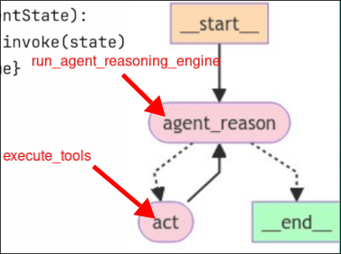

# Nodes

In this topic, we need to actually create the nodes' functions.

We crate a new file `nodes.py` and add the following code:

```py
from dotenv import load_dotenv
from langgraph.prebuilt.tool_executor import ToolExecutor

# import the Runnable object and tools we created in the previous topic
from react import react_agent_runnable, tools
# import the custom state model we defined in the previous topic
from state import AgentState


load_dotenv()


# create the function for the node `agent_reason`
def run_agent_reasoning_engine(state: AgentAction):
    agent_outcome = react_agent_runnable.invoke(state) # invoke the ReAct Runnable by whole state,
                                                       # each attribute's value will be plugged into its ReAct prompt
    return {"agent_outcome": agent_outcome} # update the state by overwriting the `agent_outcome` attribute


# Make the tools to be executable by the tool executor
tool_executor = ToolExecutor(tools)

# create the function for the node `act`
def execute_tools(state: AgentState):
    
    # tool executor will be invoked by the agent_outcome the from the previous node
    agent_action = state["agent_outcome"]
    output = tool_executor.invoke(agent_action)

    # update the state by APPENDING the intermediate steps with the agent action to the tool executor and its output
    return {"intermediate_steps": [(agent_action, str(output))]}

```


