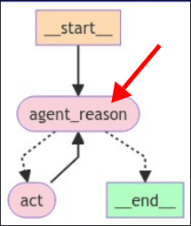
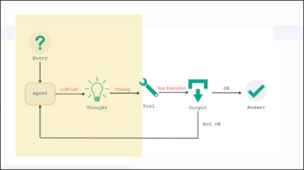

# ReAct Runnable



We need to implement the logic part of the most important node `agent_reason` in the graph for this topic, which is the inference logic of the ReAct agent. We need to let LLM determine the direction of the next node.

We create a new file `react.py` to write the logic of the node `agent_reason`:

```py
from dotenv import load_dotenv
from langchain import hub
from langchain.agents import create_react_agent
from langchain_community.tools.tavily_search import TavilySearchResults
from langchain_core.prompts import PromptTemplate
from langchain_core.tools import tool
from langchain_openai import ChatOpenAI


load_dotenv()


# prepare the ReAct prompt, which make the regular LLM to reasoning agent
react_prompt: PromptTemplate = hub.pull("hwchase17/react")
# Answer the following questions as best you can. You have access to the following tools:
#
# {tools}
#
# Use the following format:
#
# Question: the input question you must answer
# Thought: you should always think about what to do
# Action: the action to take, should be one of [{tool_names}]
# Action Input: the input to the action
# Observation: the result of the action
# ... (this Thought/Action/Action Input/Observation can repeat N times)
# Thought: I now know the final answer
# Final Answer: the final answer to the original input question
#
# Begin!
#
# Question: {input}
# Thought:{agent_scratchpad}

# create custom tool by wrapping a regular function with the `tool` decorator 
@tool
def triple(num: float) -> float:
    """
    :param num: a number to triple
    :return: the number tripled -> multiplied by 3
    """
    return 3 * float(num)


# prepare two tools for the agent to choose from, one is a search tool directly from LangGraph library and the other is a custom tool
tools = [TavilySearchResults(max_results=1), triple]

# prepare the LLM model
llm = ChatOpenAI(model="gpt-4o-mini")

# compose all the parts together to a Runnable object
react_agent_runnable = create_react_agent(llm, tools, react_prompt)
#                      ^^^^^^^^^^^^^^^^^^ this function helps to plug tools definitions/names into react_prompt
#                                         and also parse the LLM response to get the final answer
#                                         and it returns a Runnable object which means it can be `invoked`

```

The process above should be very familiar because similar codes have been written in the LangChain course, but in the later part we will use LangGraph for implementation instead of using Agent Executor or writing while loops ourselves.




