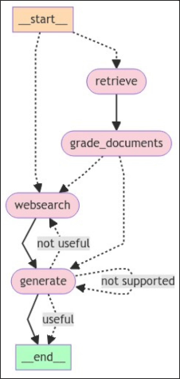
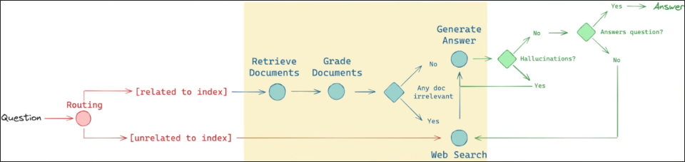
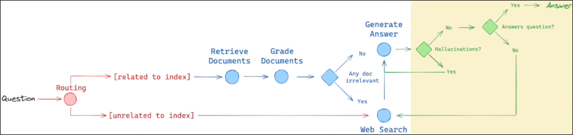
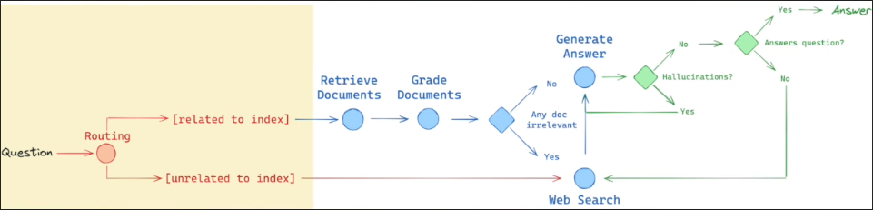

# What are Building in this Section: Advanced RAG Architecture

We want to implement an advanced complex RAG workflow that is going to yield us much more quality results than we're used.

This project is inspired by th LangChain and Mistral Cookbook.
[Cookbook](https://github.com/mistralai/cookbook/tree/main/third_party/langchain)
[YouTube video](https://www.youtube.com/watch?v=sgnrL7yo1TE)

But It lacks in their cookbook is the software engineering perspective. What his course did is to take their code and change it and refactor it so it would be more production oriented. This is, it'll be more maintainable, more readable, more testable and it's easier to extend if you want to add more functionality.

This workflow is based on three papers: Self-RAG, Collective-RAG, and Adaptive-RAG. And we'll be covering the gist of those papers further in this section. But the general idea of those papers is to add reflection into our workflow.

We want to reflect on the documents that we retrieve and to see if they are indeed correct for us or not. We want to QA those documents and add new information if it's not enough.

After it, we also want reflect our answer. So we want to check if the answer is indeed grounded in the documents, and that the answer indeed answers the question.

And also there is a routing element where we're going to route our request to the correct datastore that is going to have the information for our answer.

Above is a quick overview of what we're going to build in this section.

And all of the code for this section is in a public GitHub repository, which you can reference at any time when you're watching the videos.

[GitHub Repository](https://github.com/emarco177/langgaph-course)

