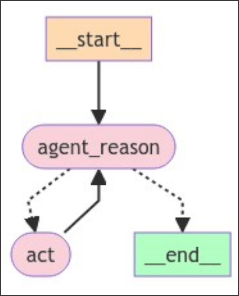

# What are we building?

In LangChain's course, we have learned to use the ReAct agent. Its logic is very complex, but in this section, we will use LangGraph to implement it. You will see that its logic becomes much simpler and clearer.

We will have two tools to help us complete this project:

```py
tools = [TavilySearchResults(max_results=1), triple]
#                                            ^^^^^^ custom tool we'll write
``` 

The problem we use to invoke the graph will be:
> "what is the weather in sf? List it and then Triple it."

In the LangChain course, we have done similar things before. At that time, we needed to write the entire analysis of the ReAct agent's response ourselves to see if there were 'Action' and 'Action input' to determine which tool to use or give the final answer. However, after using LangGraph, it becomes very simple.


