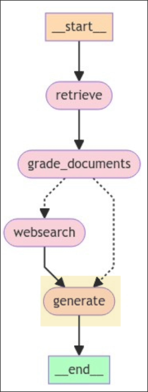

# Augmentation Generation Node




In this topic, we want to create a chain that uses the augmented prompt by the state documents and call it in the function of node `generate` to get the final answer and store it in the state `generation`.


## Create a chain that uses the augmented prompt

```sh
 tree
.
├── graph
│   ├── chains
│   │   ├── generation.py # new file to create a chain that uses the augmented prompt
│   │   ├── __init__.py
│   │   ├── retrieval_grader.py
│   │   └── tests
│   │       ├── __init__.py
│   │       └── test_chains.py
│   ├── consts.py
│   ├── graph.py
│   ├── __init__.py
│   ├── nodes
│   │   ├── grade_documents.py
│   │   ├── __init__.py
│   │   ├── retrieve.py
│   │   └── web_search.py
│   └── state.py
├── ingestion.py
└── main.py
```

```py
from langchain import hub
from langchain_core.output_parsers import StrOutputParser
from langchain_openai import ChatOpenAI


llm = ChatOpenAI(model="gpt-4o-mini", temperature=0)
prompt = hub.pull("rlm/rag-prompt")
# You are an assistant for question-answering tasks. Use the following pieces of retrieved context to answer the question. If you don't know the answer, just say that you don't know. Use three sentences maximum and keep the answer concise.
# Question: {question} 
# Context: {context} 
# Answer:

generation_chain = prompt | llm | StrOutputParser()

```

## Write the test for the chain

File: /home/matt/Projects/langgraph-course/graph/chains/tests/test_chains.py
```python
...

from graph.chains.generation import generation_chain

...

def test_generation_chain() -> None:
    question = "agent memory"
    docs = retriever.invoke(question)
    generation = generation_chain.invoke({"context": docs, "question": question}) # mainly test this line to check if the chain works only
    print(generation)                                                             # so here we just print the output, no assertion
```

Run the test with `pytest` command:

```sh
graph/chains/tests/test_chains.py::test_generation_chain

"Agent memory in LLM-powered autonomous systems consists of short-term and long-term memory. Short-term memory involves in-context learni ng, while long-term memory allows agents to retain and recall information over extended periods, often using an external vector store for fast retrieval. This memory structure enhances the agen t's ability to learn from past experiences and improve future performance."

PASSED

```

## Create the function of the node `generate`

```sh
 tree
.
├── graph
│   ├── chains
│   │   ├── generation.py
│   │   ├── __init__.py
│   │   ├── retrieval_grader.py
│   │   └── tests
│   │       ├── __init__.py
│   │       └── test_chains.py
│   ├── consts.py
│   ├── graph.py
│   ├── __init__.py
│   ├── nodes
│   │   ├── generate.py  # new file, write the logic(function) of node `generate`
│   │   ├── grade_documents.py
│   │   ├── __init__.py
│   │   ├── retrieve.py
│   │   └── web_search.py
│   └── state.py
├── ingestion.py
└── main.py

```

```py
from typing import Any, Dict
from graph.chains.generation import generation_chain
from graph.state import GraphState


def generate(state: GraphState) -> Dict[str, Any]:
    print("---GENERATE---")
    question = state["question"]
    documents = state["documents"]

    # call the chain to generate the answer with prompt input as a dictionary
    generation = generation_chain.invoke({"context": documents, "question": question})

    # update the state by given the generation
    return {"generation": generation}

```
