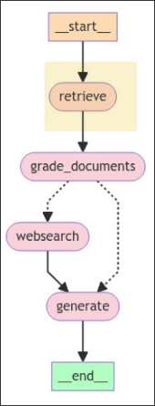

# Retriever Node




In this topic, we want to write the logic of the retriever node, which should be a function with GraphState as input and a dictionary as output to update the state.

```sh
 tree
.
├── graph
│   ├── chains
│   │   ├── __init__.py
│   │   └── tests
│   │       ├── __init__.py
│   │       └── test_chains.py
│   ├── consts.py
│   ├── graph.py
│   ├── __init__.py
│   ├── nodes
│   │   ├── __init__.py
│   │   └── retrieve.py # new file, to write the logic(function) for the retriever node
│   └── state.py
├── ingestion.py
└── main.py

```

```py
from typing import Any, Dict
from graph.state import GraphState
from ingestion import retriever # import the retriever we prepared before, we can use to do similarity search and retrieve documents


def retrieve(state: GraphState) -> Dict[str, Any]:
    print("---RETRIEVE---")
    question = state["question"]
    documents = retriever.invoke(question)

    return {"documents": documents} # update the state by overwriting the documents

```

## Some doubts...

But isn't the result returned by the retriever a Document object? And the state attribute `documents` was defined as a list of strings in the previous topic, so it should be saving the content of Document objects, right?
