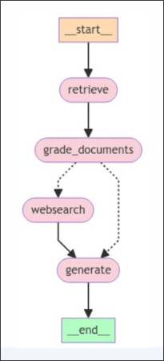

# State



We want to define custom state for above graph.


File: /home/matt/Projects/langgraph-course/graph/state.py
```python
from typing import List, TypedDict
from langchain_core.documents import Document


class GraphState(TypedDict):
    """
    Represents the state of our graph.

    Attributes:
        question: question
        generation: LLM generation
        web_search: whether to add search
        documents: list of documents
    """

    question: str
    generation: str
    web_search: bool
    documents: List[Document]

```

**question**:
Because the initial question will be constantly referenced, such as determining if it is related to retrieving documents or if the information from internet searches is relevant, we need to store it in the state.

**generation**:
LLM generation

**web_search**:
Decide whether more information needs to be searched on the internet. So it is a boolean value.

**documents**:
List of documents that are retrieved from the vector storage or searched on the internet.


