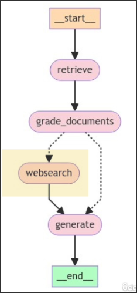

# Tavily Web Search Node



In this topic, we need to write the logic for the node `web_search`. 

This node is only executed when any retrieved documents have been filtered out in the node `grade_documents`. It will use the Tavily API to search the web and add the results to the state documents.

```sh
 tree
.
├── graph
│   ├── chains
│   │   ├── __init__.py
│   │   ├── retrieval_grader.py
│   │   └── tests
│   │       ├── __init__.py
│   │       └── test_chains.py
│   ├── consts.py
│   ├── graph.py
│   ├── __init__.py
│   ├── nodes
│   │   ├── grade_documents.py
│   │   ├── __init__.py
│   │   ├── retrieve.py
│   │   └── web_search.py # new file, write the logic of node `web_search` here
│   └── state.py
├── ingestion.py
└── main.py
```

```py
from typing import Any, Dict
from langchain_community.tools.tavily_search import TavilySearchResults
from graph.state import GraphState
from dotenv import load_dotenv


load_dotenv()


web_search_tool = TavilySearchResults(max_results=3) # create tool simply from the class TaviySearchResults

def web_search(state: GraphState) -> Dict[str, Any]:
    print("---WEB SEARCH---")

    question = state["question"]

    tavily_results = web_search_tool.invoke({"query": question}) # invoke the tool with the question to get the results

    print(tavily_results) # print the results
    # [
    #     {
    #         'url': 'https://www.deeplearning.ai/short-courses/llms-as-operating-systems-agent-memory/',
    #         'content': 'LLMs as Operating Systems: Agent Memory - DeepLe arning.AI Build ...'
    #     },
    #     {
    #         'url': 'https://docs.aws.amazon.com/b edrock/latest/userguide/agents-configure-memory.html',
    #         'content': 'Enable agent memory - Amazon Bedrock Enable agent memory - Amazon ...'
    #     },
    #     {
    #         'url': 'https://blog.langchain.dev/memory-for-agents/',
    #         'content': 'Memory for agents Memory for agents At Sequoia’s AI Ascent conference in ...'
    #     }
    # ]

# test above codes
if __name__ == "__main__":
    web_search(state={"question": "agent memory", "documents": []})

```

Then, we want join all the contents of the results as a single string and append it to the state documents.

```py
...

def websearch(state: GraphState) -> Dict[str, Any]:
#   ^^^^^^^^^ cannot use the same name as state attribute, so we should prevent to use `web_search` as the function name
    print("---WEB SEARCH---")

    question = state["question"]

    tavily_results = web_search_tool.invoke({"query": question})

    # join all the contents of the results as a single string
    joined_tavily_result = "\n".join(
        [tavily_result["content"] for tavily_result in tavily_results]
    ) 

    # because state documents is a list of Document objects, we need to convert the joined_tavily_result to a Document object
    # then we can append it to the state documents
    web_results = Document(page_content=joined_tavily_result)
    documents = state["documents"].append(web_results)

    # update the state with the new documents
    return {"documents": documents}

```


