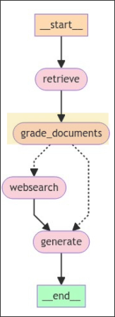

# retrieva_grader chain



We will use a chain in the node `grade_documents` to check each document and question for relevance one by one, and then output a structured data as a Pydantic object.

So we want to write that chain in a new file `retrieva_grader.py` under the module `graph.chains`.

```sh
 tree
.
├── graph
│   ├── chains
│   │   ├── __init__.py
│   │   ├── retrieval_grader.py # new file to create a chain that grades the document with a binary score `yes` or `no`
│   │   └── tests
│   │       ├── __init__.py
│   │       └── test_chains.py
│   ├── consts.py
│   ├── graph.py
│   ├── __init__.py
│   ├── nodes
│   │   ├── __init__.py
│   │   └── retrieve.py
│   └── state.py
├── ingestion.py
└── main.py

```

```py
from langchain_core.prompts import ChatPromptTemplate
from langchain_core.pydantic_v1 import BaseModel, Field
from langchain_openai import ChatOpenAI


llm = ChatOpenAI(model="gpt-4o-mini", temperature=0)

# Define a Pydantic model for the structured output of the chain
class GradeDocument(BaseModel):
    """Binary score for relevance check on a retrieved document."""

    binary_score: str = Field(
        description="The docoument are relevant to the question, 'yes' or 'no'."
    )


structured_llm_grader = llm.with_structured_output(GradeDocument)
#                          ^^^^^^^^^^^^^^^^^^^^^^^^^^^^^^^^^^^^^^ this method is to force the output of the LLM to be a structured data as a Pydantic object
#                                                                 It'll let LLM to use the function calling to the Pydantic model as a tool under the hood
#                                                                 to archieve the structured data output

grade_prompt = ChatPromptTemplate.from_messages(
    [
        ("system", """You are a grader assessing relevance of a retrieved document to a user question. \n
         If the document contains keyword(s) or semantic meaning related to the question, grade it as relevant. \n
         Give a binary score of 'yes' or 'no' to indicate whether the document is relevant to the question."""),
        ("human", "Retrieved document: \n\n {document} \n\n User question: {question}"),
    ]
)

retrieval_grader = grade_prompt | structured_llm_grader

```

We used `.bind_tool` before to structure the output of LLM, but this time we used `.with_structured_output` to achieve the same effect, and it is even easier (because it omits the step of converting Pydantic model to tool).


