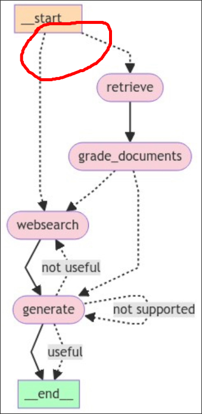

# Adaptive RAG Intro

In this topic, we are going to implement `Adaptive RAG` into our graph.

## What is Adaptive RAG?

It's a fancy word of simply using a question router to route our question to different RAG flows.

## How to implement Adaptive RAG?

We will create a chain to determine if there is information about the question in the vector storage, and then create a conditional edge to use it, so that the effect of Adaptive RAG can be achieved.

