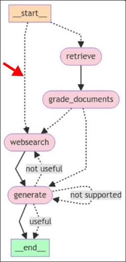

# Conditional Entry Point

After creating [[2025-03-04_Question-Router-Chain|Question Router Chain]], back to the graph, we want to create a conditional entry point which is a conditional edge connected with START node. And we'll use the router chain to decide which flow to go.


File: /home/matt/Projects/langgraph-course/graph/graph.py
```python
...

from graph.chains.router import question_router, RouteQuery

...

# workflow.set_entry_point(RETRIEVE)  # instead of .set_entry_point, we'll use .set_conditional_entry_point

# logic to decide which flow to go
def route_question(state: GraphState) -> str:
    print("---ROUTE QUESTION---")
    question = state["question"]
    res = question_router.invoke({"question": question})

    if isinstance(res, RouteQuery):
        return res.datasource
    else:
        raise ValueError("Router did not return a valid datasource.")

# set conditional entry point with above logic, which is a conditional edge connected with START node
workflow.set_conditional_entry_point(
    route_question, # logic to decide which flow to go
    # map the return value of route_question to the node name
    {
        "vectorstore": RETRIEVE,
        "websearch": WEBSEARCH,
    }
)

workflow.add_edge(RETRIEVE, GRADE_DOCUMENTS)

def decide_to_generate(state: GraphState) -> str:
    print("---ASSESS GRADED DOCUMENTS---")

    if state["web_search"]:
        print(
            "---DECISION: NOT ALL DOCUMENTS ARE NOT RELEVANT TO QUESTION---"
        )
        return WEBSEARCH

    print("---DECISION: ALL DOCUMENTS ARE RELEVANT TO QUESTION---")
    return GENERATE

workflow.add_conditional_edges(
    GRADE_DOCUMENTS,
    decide_to_generate,
    {
        WEBSEARCH: WEBSEARCH,
        GENERATE: GENERATE,
    }
)
workflow.add_edge(WEBSEARCH, GENERATE)

# workflow.add_edge(GENERATE, END)

def grade_generation_grounded_in_documents_and_question(state: GraphState) -> str:
    print("---CHECK HALLUCIATIONS---")
    question = state["question"]
    documnents = state["documents"]
    generation = state["generation"]

    score = hallucination_grader.invoke(
        {"documents": documnents, "generation": generation}
    )
    
    if isinstance(score, GradeHallucinations):
        score = score.binary_score
        if score:
            print("---DECISION: GENERATION IS GROUNDED IN DOCUMENTS---")
            score = answer_grader.invoke(
                {"question": question, "generation": generation}
            )
            if isinstance(score, GradeAnswer):
                score = score.binary_score
                if score:
                    print("---DECISION: ANSWER ADDRESSSES QUESTION---")
                    return 'useful'
                print("---DECISION: ANSWER DOES NOT ADDRESS QUESTION---")
                return 'not useful'
            else:
                raise ValueError("Answer grader did not return a valid score.")
        else:
            print("---DECISION: GENERATION IS NOT GROUNDED IN DOCUMENTS---")
            return 'not supported'
    else:
        raise ValueError("Hallucination grader did not return a valid score.")
    
workflow.add_conditional_edges(
    GENERATE,
    grade_generation_grounded_in_documents_and_question,
    {
        'useful': END,
        'not useful': WEBSEARCH,
        'not supported': GENERATE
    }
)

graph = workflow.compile()
```

Test the grap with the question related to the content of the vector store.


File: /home/matt/Projects/langgraph-course/main.py
```python
from dotenv import load_dotenv
load_dotenv()
from graph.graph import graph


if __name__ == "__main__":
    print("Hello Advanced RAG")
    print(graph.invoke(input={"question": "What is agent memory?"}))
```

```sh
 python main.py
Hello Advanced RAG
---ROUTE QUESTION---
---RETRIEVE---
---CHECK DOCUMENT RELEVANCE TO QUESTION---
---ASSESS GRADED DOCUMENTS---
---DECISION: NOT ALL DOCUMENTS ARE NOT RELEVANT TO QUESTION---
---WEB SEARCH---
---GENERATE---
---CHECK HALLUCIATIONS---
---DECISION: GENERATION IS GROUNDED IN DOCUMENTS---
---DECISION: ANSWER ADDRESSSES QUESTION---
...

```

From the logs, we can see that the graph takes the path of `RETRIEVE -> GRADE_DOCUMENTS -> WEBSEARCH -> GENERATE -> END` which is the expected path for the question related to the content of the vector store.


Let's test the graph with the question not related to the content of the vector store.


File: /home/matt/Projects/langgraph-course/main.py
```python
from dotenv import load_dotenv
load_dotenv()
from graph.graph import graph


if __name__ == "__main__":
    print("Hello Advanced RAG")
    print(graph.invoke(input={"question": "How to make a cake?"}))
```

```sh
 python main.py
Hello Advanced RAG
---ROUTE QUESTION---
---WEB SEARCH---
Traceback (most recent call last):
  File "/home/matt/Projects/langgraph-course/main.py", line 8, in <module>
    print(graph.invoke(input={"question": "How to make a cake?"}))
          ~~~~~~~~~~~~^^^^^^^^^^^^^^^^^^^^^^^^^^^^^^^^^^^^^^^^^^^
  File "/home/matt/.local/share/virtualenvs/langgraph-course-uhZ6dcGU/lib/python3.13/site-packages/langgraph/pregel/__init__.py", line 2336, in invoke
    for chunk in self.stream(
                 ~~~~~~~~~~~^
        input,
        ^^^^^^
    ...<6 lines>...
        **kwargs,
        ^^^^^^^^^
    ):
    ^
  File "/home/matt/.local/share/virtualenvs/langgraph-course-uhZ6dcGU/lib/python3.13/site-packages/langgraph/pregel/__init__.py", line 1993, in stream
    for _ in runner.tick(
             ~~~~~~~~~~~^
        loop.tasks.values(),
        ^^^^^^^^^^^^^^^^^^^^
    ...<2 lines>...
        get_waiter=get_waiter,
        ^^^^^^^^^^^^^^^^^^^^^^
    ):
    ^
  File "/home/matt/.local/share/virtualenvs/langgraph-course-uhZ6dcGU/lib/python3.13/site-packages/langgraph/pregel/runner.py", line 230, in tick
    run_with_retry(
    ~~~~~~~~~~~~~~^
        t,
        ^^
    ...<4 lines>...
        },
        ^^
    )
    ^
  File "/home/matt/.local/share/virtualenvs/langgraph-course-uhZ6dcGU/lib/python3.13/site-packages/langgraph/pregel/retry.py", line 40, in run_with_retry
    return task.proc.invoke(task.input, config)
           ~~~~~~~~~~~~~~~~^^^^^^^^^^^^^^^^^^^^
  File "/home/matt/.local/share/virtualenvs/langgraph-course-uhZ6dcGU/lib/python3.13/site-packages/langgraph/utils/runnable.py", line 546, in invoke
    input = step.invoke(input, config, **kwargs)
  File "/home/matt/.local/share/virtualenvs/langgraph-course-uhZ6dcGU/lib/python3.13/site-packages/langgraph/utils/runnable.py", line 310, in invoke
    ret = context.run(self.func, *args, **kwargs)
  File "/home/matt/Projects/langgraph-course/graph/nodes/web_search.py", line 26, in websearch
    documents = state["documents"] + [web_results]
                ~~~~~^^^^^^^^^^^^^
KeyError: 'documents'
During task with name 'websearch' and id '49c986c9-cb9b-60f1-b5b5-a45ebf629f4b'

```

We got an error because the graph takes the path without passing through the node `RETRIEVE` which is responsible for setting the initial value of state `documents`. So the state `documents` has no any value yet when the graph reaches the node `WEBSEARCH`. We want to modify the logic of the node `WEBSEARCH` to handle the case when the state `documents` is not set.

File: /home/matt/Projects/langgraph-course/graph/nodes/web_search.py
```python
from typing import Any, Dict
from langchain_community.tools.tavily_search import TavilySearchResults
from langchain_core.documents import Document
from graph.state import GraphState
from dotenv import load_dotenv


load_dotenv()


web_search_tool = TavilySearchResults(max_results=3)

def websearch(state: GraphState) -> Dict[str, Any]:
    print("---WEB SEARCH---")

    question = state["question"]

    tavily_results = web_search_tool.invoke({"query": question})

    joined_tavily_result = "\n".join(
        [tavily_result["content"] for tavily_result in tavily_results]
    ) 

    web_results = Document(page_content=joined_tavily_result)
    
    # handle the case when the state `documents` is not set
    if state.get("documents"):
        documents = state["documents"] + [web_results]
    else:
        documents = [web_results]

    return {"documents": documents}

```

Let's try again with the question not related to the content of the vector store.

```sh
 python main.py
Hello Advanced RAG
---ROUTE QUESTION---
---WEB SEARCH---
---GENERATE---
---CHECK HALLUCIATIONS---
---DECISION: GENERATION IS GROUNDED IN DOCUMENTS---
---DECISION: ANSWER ADDRESSSES QUESTION---
...

```

We can see that the graph takes the path of `WEBSEARCH -> GENERATE -> END` which is the expected path for the question not related to the content of the vector store.




