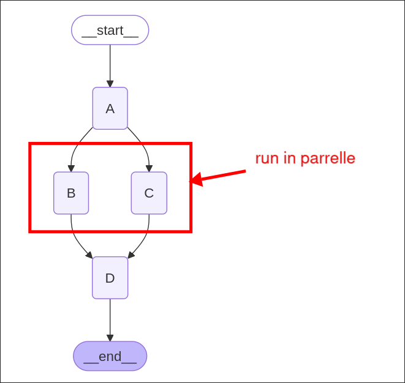

# Implementing Async Execution

LangGraph automatically helps us process multiple nodes in parallel when an edge fans out from one node to multiple nodes, we do not need to create any async functions or multi-threading code.

```py
from dotenv import load_dotenv
load_dotenv()

import operator
from typing import Annotated, Any
from typing_extensions import TypedDict
from langgraph.graph import StateGraph, END


# Define the state schema which only has one field to collect names of nodes
class State(TypedDict):
    aggregate: Annotated[list[str], operator.add]
    #                               ^^^^^^^^^^^^ so the node's return value can be added to the list automatically


# because each node do the same thing (print its name and return it), we can create a class for duplicative work
class ReturnNodeValue:
    def __init__(self, node_secret: str): # in our case, node_secret is assigned to the node's name when instantiating
        self._value = node_secret

    # overwrite the __call__ method to make the instance callable, which is treated as a node function after instantiating
    def __call__(self, state: State) -> Any:
        print(f"Adding {self._value} to {state['aggregate']}")
        return {"aggregate": [self._value]}

builder = StateGraph(State)

builder.add_node("A", ReturnNodeValue("I am A"))
builder.add_node("B", ReturnNodeValue("I am B"))
builder.add_node("C", ReturnNodeValue("I am C"))
builder.add_node("D", ReturnNodeValue("I am D"))
#                     ^^^^^^^^^^^^^^^ we can re-use the same class with different node names

builder.set_entry_point("A")

# node "A" fans out to "B" and "C", the LangGraph will process them in parallel automatically
# no need to create async functions or multi-threading code at all
builder.add_edge("A", "B")
builder.add_edge("A", "C")

builder.add_edge("B", "D")
builder.add_edge("C", "D")
builder.add_edge("D", END)

graph = builder.compile()

print(graph.get_graph().draw_mermaid())

```




```py
...

graph = builder.compile()


if __name__ == "__main__":
    graph.invoke(input={"aggregate": []})

```

Running the code above and check result in the LangSmith:

```sh
 python main.py
Adding I am A to []
Adding I am B to ['I am A'] # <--- both B and C nodes have the same state input
Adding I am C to ['I am A'] # <--- which implies they are processed in parallel
Adding I am D to ['I am A', 'I am B', 'I am C']

```


