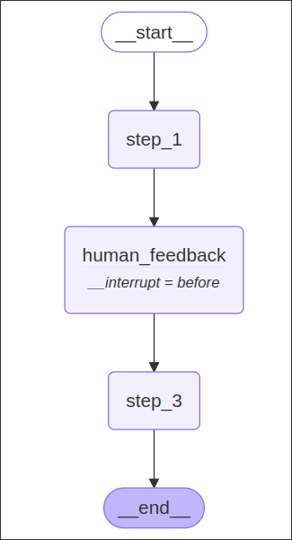

# MemorySaver + Interrupts = Human In The Loop

Create a new project for demonstrating the user interrupting the graph.

```sh
 mkdir human-in-the-loop-memory
 cd human-in-the-loop-memory/
 pipenv install langgraph langchain-community python-dotenv black isort

```

Write the code of the graph in the `main.py` file.

```python
from typing import TypedDict
from langgraph.graph import StateGraph, END
from langgraph.checkpoint.memory import MemorySaver


# Define the state
class State(TypedDict):
    input: str 
    user_feedback: str

# nodes' functions
def stept_1(state: State) -> None:
    print("--- Step 1 ---")

def human_feedback(state: State) -> None:
    print("--- Human Feedback ---")

def stept_3(state: State) -> None:
    print("--- Step 3 ---")

# Start building the graph
builder = StateGraph(State)

builder.add_node('step_1', stept_1)
builder.add_node('human_feedback', human_feedback)
builder.add_node('step_3', stept_3)

builder.set_entry_point('step_1')
builder.add_edge('step_1', 'human_feedback')
builder.add_edge('human_feedback', 'step_3')
builder.add_edge('step_3', END)

# !!! Add the MemorySaver, which is a Checkpointer object integrated with the memory storage, so it's emphemeral, which means it'll gone upon each run of the graph but it's enough for the demonstration here.
memory = MemorySaver()

graph = builder.compile(
    checkpointer=memory, # Add the MemorySaver to the graph
    interrupt_before=["human_feedback"] # Add the interrupt point to the node `human_feedback`, this only works when the Checkpointer exists
)

print(graph.get_graph().draw_mermaid())

```



Above, we made a very simple graph, without even using LLM. Each node simply prints some text.

However, during compilation, we added a *MemorySaver* object to the `checkpointer` parameter of the graph, so that we can use parameter `interrupt_before` in the graph to specify at which node the interruption can occur.


