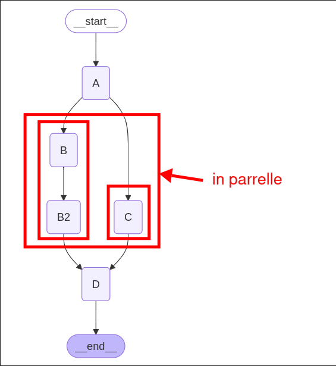

# Parallel node fan out and fan in with extra steps

In this topic, we need to add an additional node after the node `B`, and also need to process it concurrently with the nodes `C`.

```py
from dotenv import load_dotenv
load_dotenv()

import operator
from typing import Annotated, Any
from typing_extensions import TypedDict
from langgraph.graph import StateGraph, END


class State(TypedDict):
    aggregate: Annotated[list[str], operator.add]


class ReturnNodeValue:
    def __init__(self, node_secret: str):
        self._value = node_secret

    def __call__(self, state: State) -> Any:
        print(f"Adding {self._value} to {state['aggregate']}")
        return {"aggregate": [self._value]}

builder = StateGraph(State)

builder.add_node("A", ReturnNodeValue("I am A"))
builder.add_node("B", ReturnNodeValue("I am B"))
builder.add_node("B2", ReturnNodeValue("I am B2")) # New node `B2`
builder.add_node("C", ReturnNodeValue("I am C"))
builder.add_node("D", ReturnNodeValue("I am D"))

builder.set_entry_point("A")
builder.add_edge("A", "B")
builder.add_edge("A", "C")
builder.add_edge("B", "B2") # instead of connecting to `C`, we connect to `B2`
builder.add_edge(["B2", "C"], "D") # then we connect `B2` and `C` to `D`
#                ^^^^^^^^^^^ this is shorthand for connecting `B2` and `C` to `D`
#                            but only work in fan-in, NOT fan-out
builder.add_edge("D", END)

graph = builder.compile()

print(graph.get_graph().draw_mermaid())

```




```py
...

graph = builder.compile()


if __name__ == "__main__":
    graph.invoke(input={"aggregate": []})

```

```sh
 python main.py
Adding I am A to []
Adding I am B to ['I am A']
Adding I am C to ['I am A']
Adding I am B2 to ['I am A', 'I am B', 'I am C'] # even the C already done, it'll trigger D until B2 done
Adding I am D to ['I am A', 'I am B', 'I am C', 'I am B2']

```
