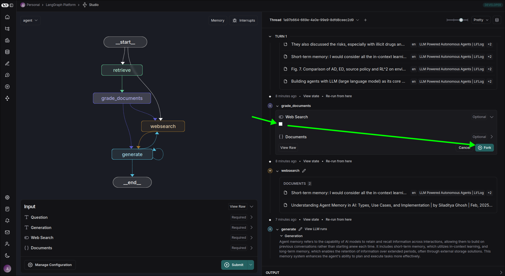

# Use the Studio to develope (edit state and reiterate)

The above is the interface of Studio started using the `langgraph dev` command. We are trying to input a Question to invoke the graph.

You can see which part is being processed in real time and the input and output of each part.

After the processing is completed, you can see the final result at the bottom.

By observing the log on the right side, we can see that the `grad_documents` node has a result of `True` for the state `Web Search`, leading to the next node being `websearch` to search for relevant information online. We can click on the `pencil` icon to modify the output state of this node.

We will change the `Web Search` status of `grade_documents` to `False`, which will generate a new thread starting from this node and using the modified status.

Because the new state of `Web Search` is `False`, there will be no more internet searching, and instead the processing will directly move to the next node `generate`.

## Conclusion

LangGraph Studio actually stores all states in a PostgreSQL database, allowing us to easily modify the content of the state and iterate on this process. This design enables us to develop and test more conveniently.

