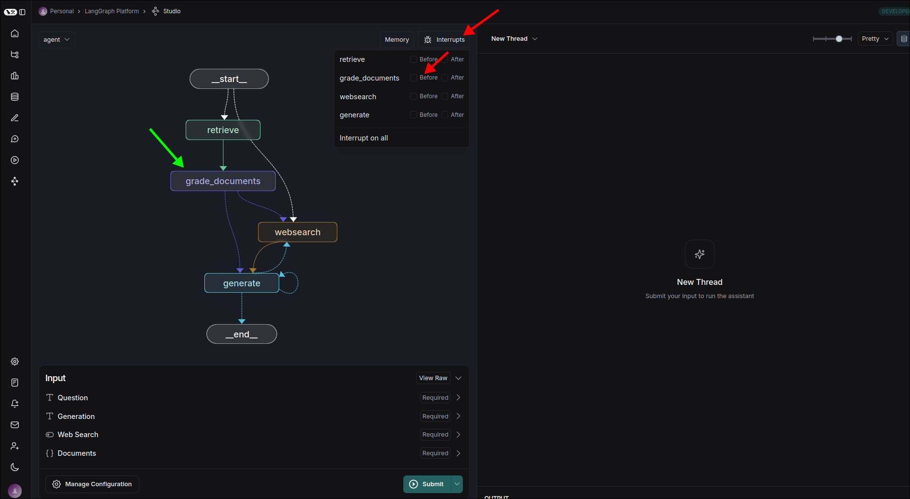
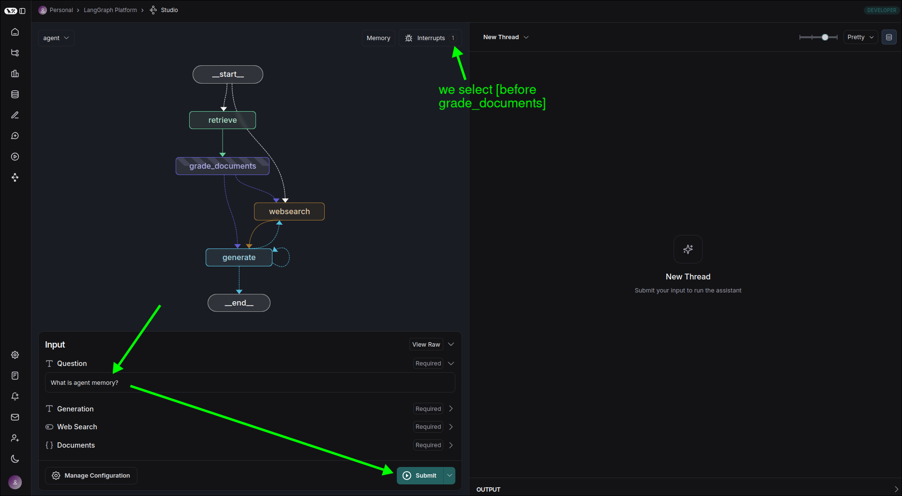
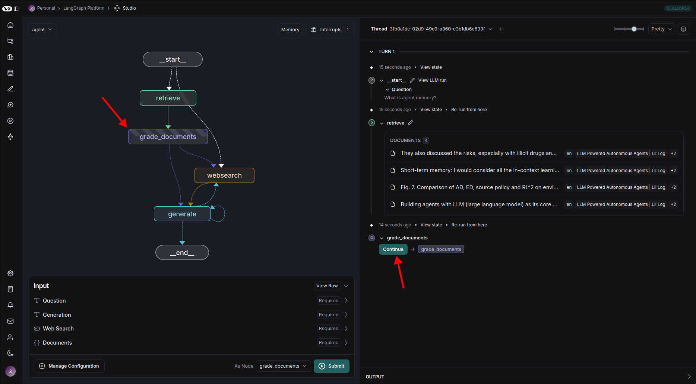

# Use the Studio to interrupt

We can use the Studio to interrupt before or after the execution of any node.

We checked the box `Before` node `grade_documents` to interrupt, and input the Question and submit.

You can see the process is interrupted before the execution of the `grade_documents` node.

And we can also resume the process by simply clicking the `Continue` button.

## Conclusion

With this feature, we can easily interrupt the process and input the required data, and then continue the process. This is very useful when we develop the process or debug the process.

