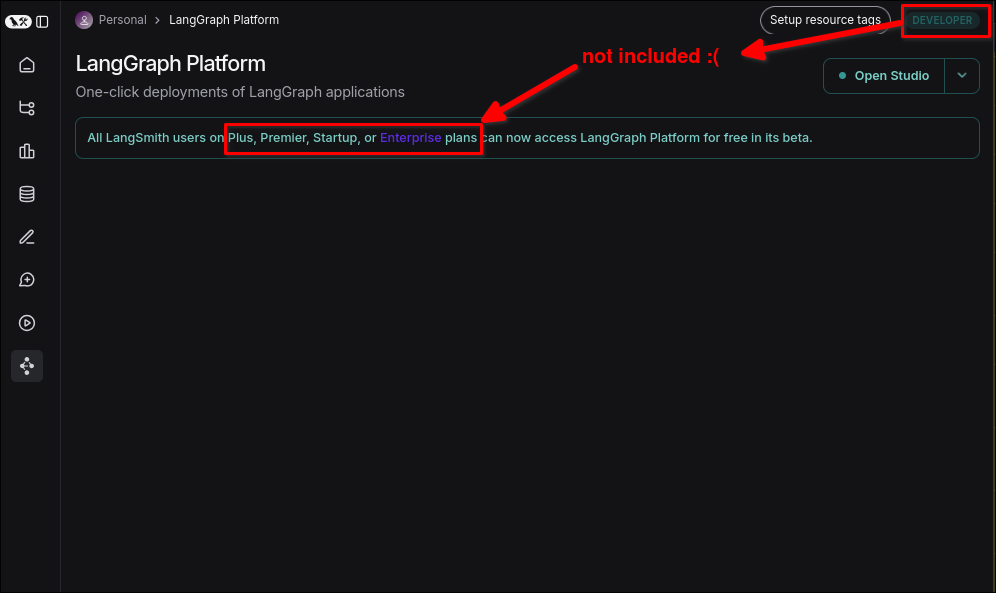

# Deploying to LangGraph Cloud

In [[2025-03-07_Create-containers-with-langgraph-up|the previous topic]], after successfully testing `langgraph up` locally, we pushed this project to the Github repository. But...

So I think now I should spend some money to use langgraph cloud service for deployment, but using `langgraph up` should also be able to deploy on other clouds.

