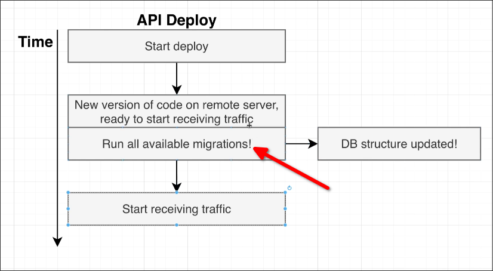

# Issues Solved by Migrations

With [[2025-03-07_Migration-Files|the concept of migrations]], we can solve [[2025-02-28_A-Story-on-Migrations|two main issues]]:

## 1. Changes to the DB structure and changes to clients need to be made at precisely the same time.

We can now add the operation of applying all migrations to the CICD pipeline, so that it can automatically execute after deploying the codes, thus minimizing the window between the DB and client. (and migration files are also version controlled)

## 2. Whenever you are working with other engineers, it is extremely important that you have a very easy way to tie the structure of your database or changes to the structure of your database, to your code as well

We can now pair the new migration file with the code changes in the same pull request, so the other engineers can easily review the code changes by applying the migration file to their local database.

After code review, they can revert the migration file to recover their local database to the previous state easily.

