# LangGraph Cloud API Deep Dive

The LangGraph Cloud API mainly consists of three core concepts: assistant, thread, and run, and is provided to users in the form of an API. This is a great reference for developers who provide front-end APIs.

## Asistant

Assistant is an abstraction layer based on a graph. We can put things like config, metadata, graph, etc. in the concept of assistant, so we can use the same assistant to change the graph or config at any time.

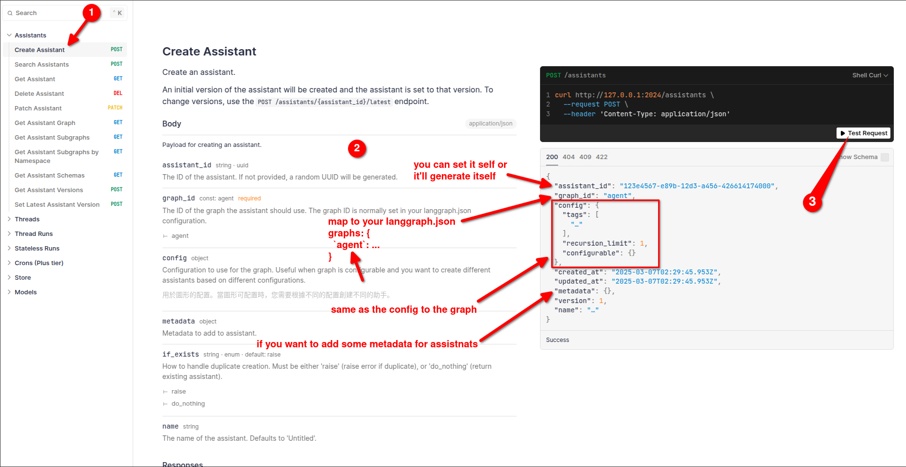
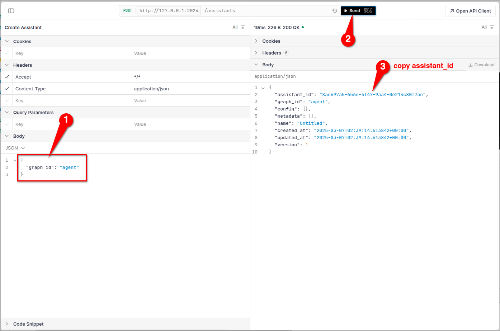

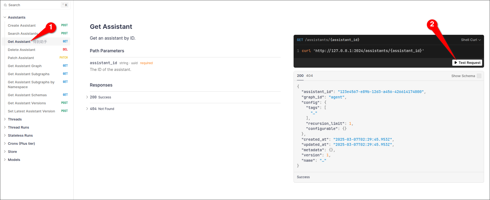

## Thread

You can think of a thread as an environment where you can execute your code and store your state, so you can continue using this state the next time you run it.

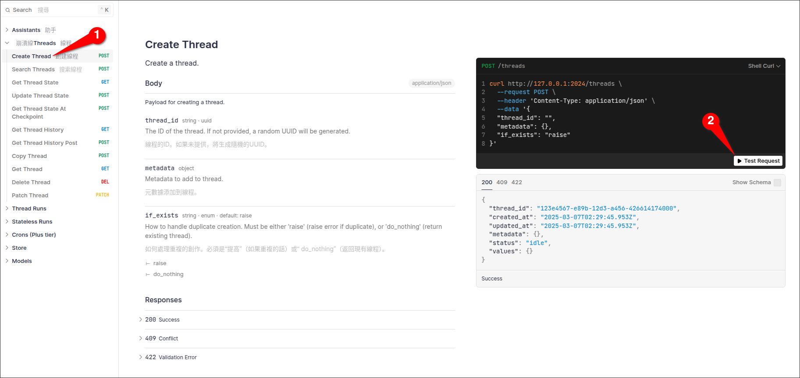

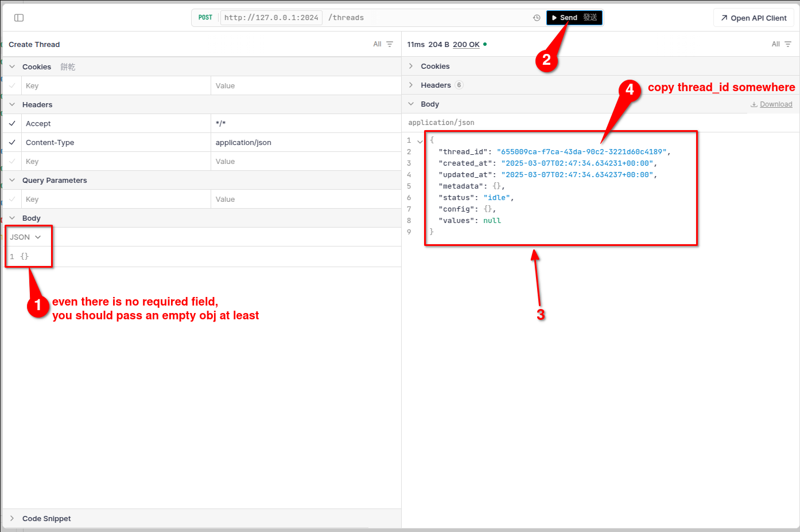

## Run

"run" means to actually execute an assistant and run it in a thread.

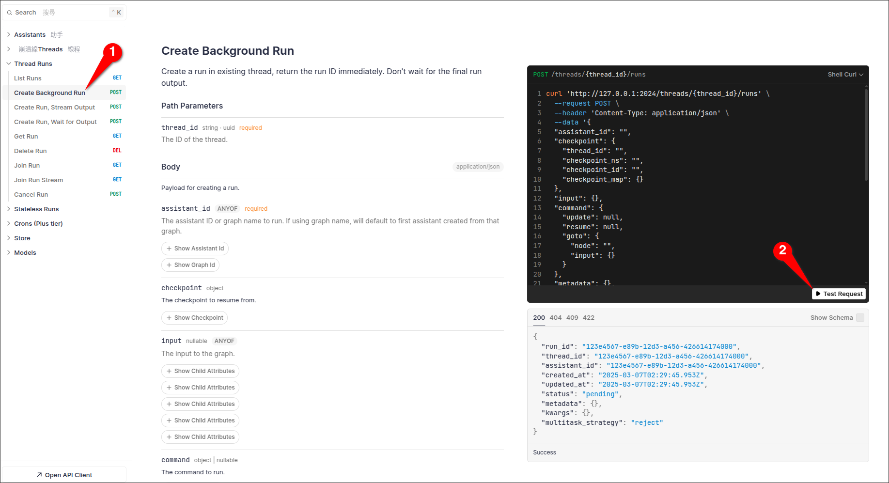

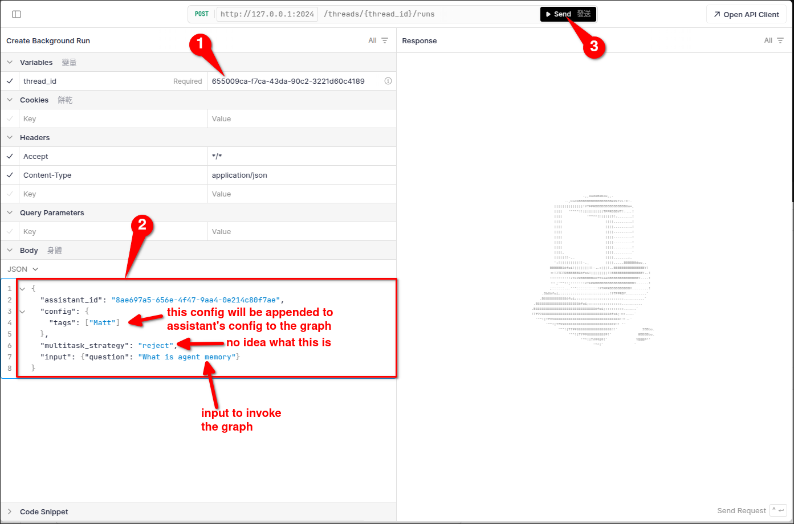

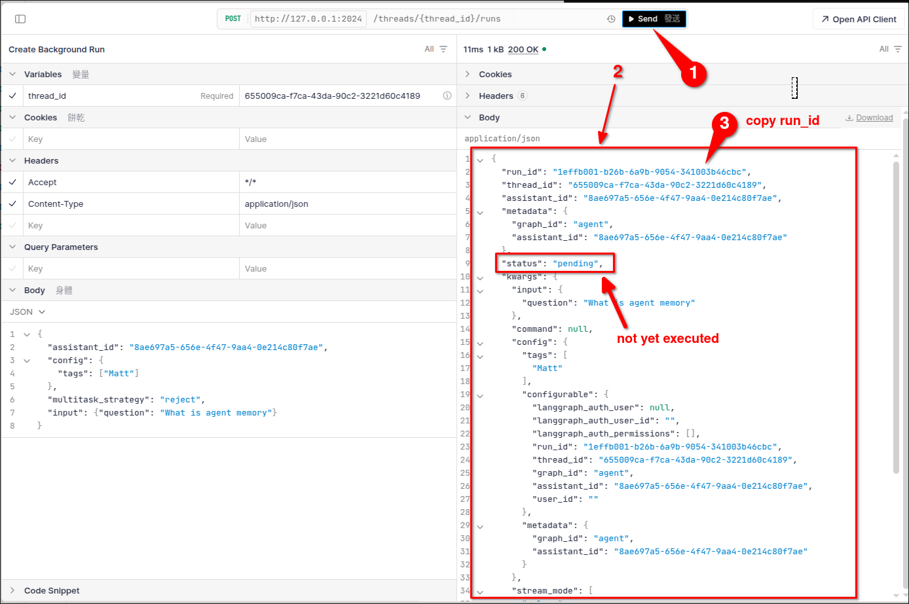

## Where to find the result state??

It is important to note that the result (state) of a run is saved in the thread, not in the run itself.

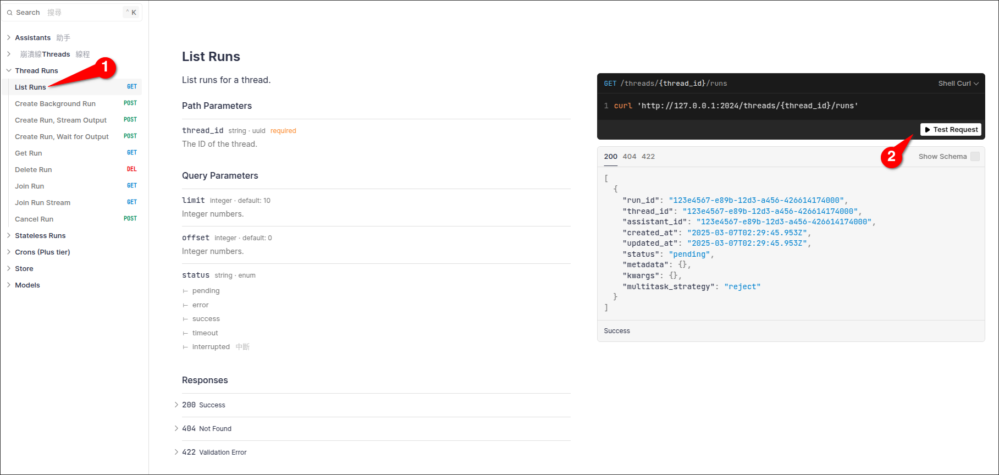

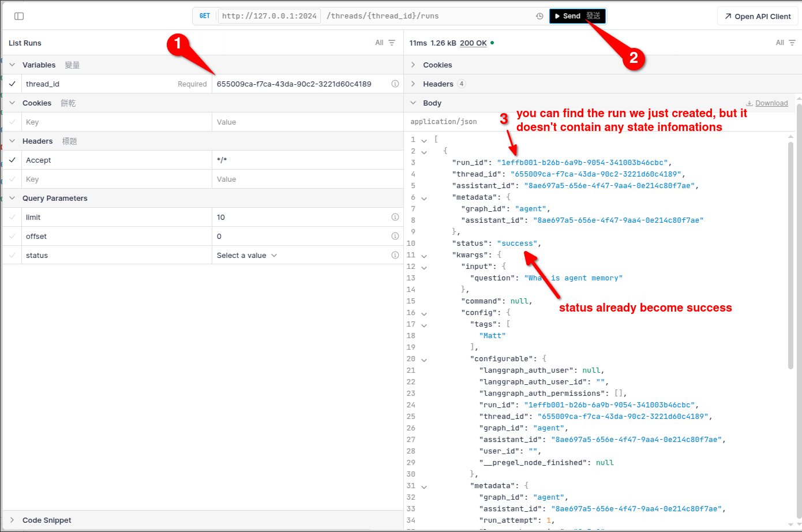

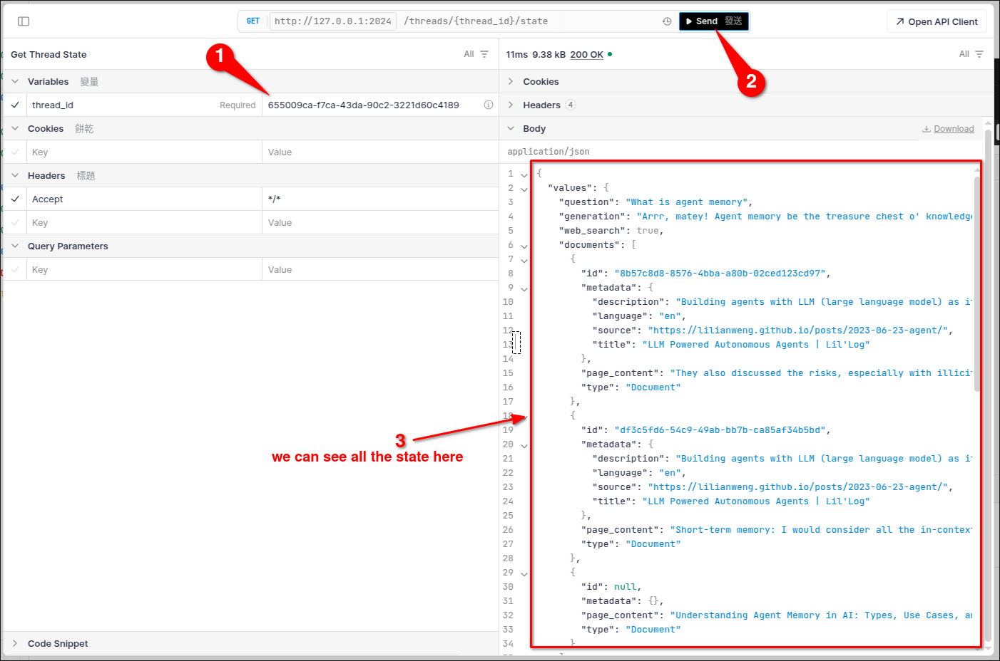

