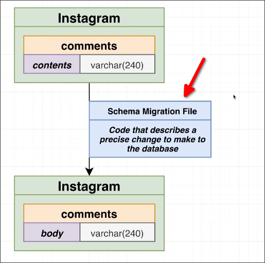
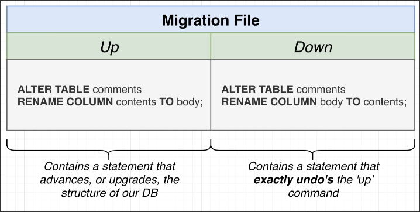
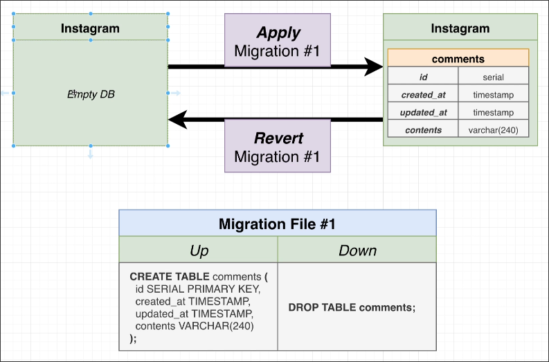
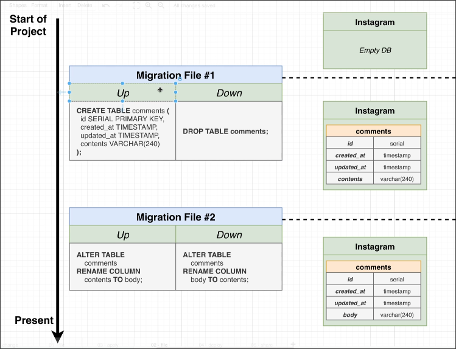

# Migration Files

In [[2025-02-28_A-Story-on-Migrations|the previous topic]], we learned two lessons about changing the database schema, and we can use a way to resolve these issues - migration files.

Before we directly use SQL script to change the database schema, and it occurs some issues.

So, instead of using SQL scripts, we can use migration files to change the database schema.

## What is a Migration File?

**Migration files include two parts: Up and Down.**

So, with them, we can do two operations:

As above, we can even build some tables from a empty database with migration files. And use the Down part to revert the database to the initial state (in this case, an empty database).

**Migration files don't tie to a specific language or framework.**

## Instead of giving a database to other engineers, we can give them migration files. 

Therefore, instead of giving other engineers a copy of the database, it is better to give them migration files so that they can build it up from a blank database themselves.

## Fix the problem migration

If any issues are found during the migration process, you can revert to the migration file, modify the problematic migration file, and then reapply it.

