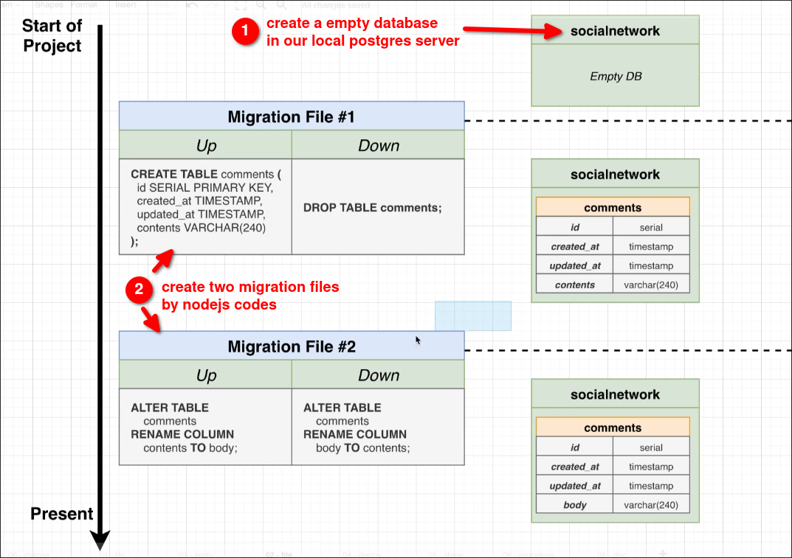

# Project Creation

## Create a nodejs project

```sh
mkdir ig
cd ig
npm init -y # create package.json, so we can install packages
npm install node-pg-migrate pg # pg=postgres, it can be used to connect to postgres database

```

## What are we going to do?



We'll implement the above steps in the next topic.


