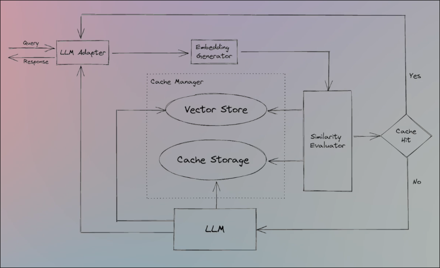
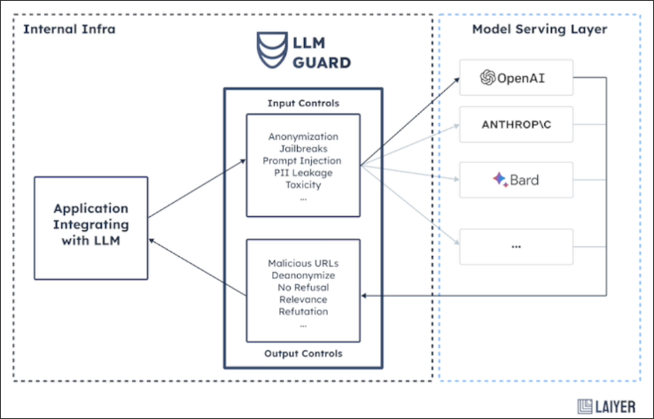

# Agents In Production

When using agents in a production environment, there are many challenges to be aware of:

## Runtime

When we create an AI Empowered Application, we will call upon many LLMs as reasoning engines because we need them to choose the correct tools or answer questions, and these calls are made one after another, with each call waiting for the result of the previous one.

So depending on the difficulty of the task, we decide to make how many reasoning steps, this can easily escalate our application to a long running time, which is a big problem.

And there are some workarounds for this, like using a *semantic cache* and using an *LM cache*, but we'll not discuss it in this course.

## Context Window

Every time we want LLM to perform reasoning, we need to send it a huge prompt, which is easy to exceed the context window limit of LLM. Even if it does not exceed the limit, *LLM is easily forgetful of the content in the middle when facing a longer prompt*, which will lead to inaccurate reasoning results from LLM.

## Hallucinations

*Hallucinations* are when you ask LLM a question, but it responds with a completely unrelated answer, because LLM is generating tokens one after another.

We can use *retrieve augmentation* to reduce the probability of hallucinations in LLM generation.

## Fine Tuning

Because LLM is a statistical creature, it will have some biases. For example, when we rely on LLM to select tools, it may have a 90% chance of choosing the correct tools. This may sound good, but when an application has 10 tools that need to be selected by sequence, the final probability will drop to 0.9^10 = 0.35, which is not very reliable.

We can use the technique of *fine tuning* to improve the accuracy of selecting tools for the LLM.

## Pricing

When our tasks are very complex, we need to use LLM many times and send a large amount of prompts to LLM, which will lead to an increase in our costs and make it not financially worth it for us to run those agents.

There are couple of ways to reduce the cost, the first one is to use *semantic cache* instead of making an LLM call.

And the other one is to use *retrieval augmentation* for tool selection, we're going to show this in this course, but retrieval augmentation for the tool selection can also handle in a case where we have too many tools to choose.

So in that way before we make the LLM call for the reasoning process, we do a *semantic search* and retrieve those relevant tools that have a high probability to be the correct tools to our answer.

## Response Validation

Because we rely on the response of LLM to operate our application, such as selecting some tools or outputting something to the user, we need a mechanism to validate this.

Because even if the LLM response is correct, if it is not in the *correct format*, it can still mess up our application.

So testing it is very complicated task, and I personally haven't found a robust solution for this issue.

## Security

In AI Empowered Application, we give LLM a lot of permissions, such as being able to choose tools to access the database. If someone maliciously hijacks our prompt with prompt injection to make LLM call tools according to their intent, it will pose a great threat to our application.

And overall we want to adhere to *the least privilege principle*, which means that we only give those tools and to those agents the minimum permissions as thery require to do their job.

And we want to have *guardrails on the prompts* we sent to our agents and to allow and not allowed maybe some prompts.

So there are many open source solutions for this, I recommend using *LLM guard* which is an open source that I think is a very promising one, which offers a lot of functionalities when it comes to LLM security.

## Overkilling

When there are tasks that can be solved using *deterministic code*, we should not use agents, because as mentioned earlier, agents face many challenges.

